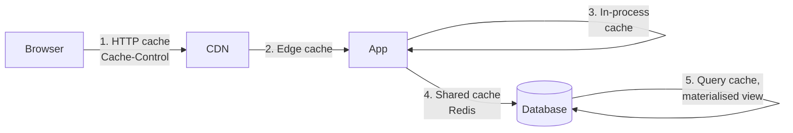

## The situation

Something is slow. Someone suggests a cache. It works immediately, everyone is
happy, and six months later you are debugging why one customer sees another
customer's data on Tuesdays.

Caching is the highest ratio of "obvious win" to "subtle disaster" in the
field. The wins are real. So are the disasters.

## The default

Before adding any cache, answer these four in writing:

1. **What invalidates it?** If the answer is "a TTL," you have accepted a window
   of wrongness. Name the window and confirm someone is okay with it.
2. **What is the key, exactly?** Including tenant, user, locale, permission
   context, and API version. Most cache-poisoning incidents are a key missing a
   dimension.
3. **What happens when it is empty?** Cold start, eviction, or a flush. If the
   origin cannot survive a 0% hit rate, the cache is not an optimisation — it is
   a load-bearing component with no redundancy.
4. **What happens when it is wrong?** Stale price, stale permission, stale
   feature flag. Rank the consequence.

Question 3 is the one that causes outages, and question 2 is the one that
causes incidents you have to disclose.

## Where to put it

Cheapest and safest on the left, most flexible and most dangerous on the right.
A `Cache-Control` header costs nothing, invalidates naturally, and cannot leak
across users if you set it correctly. Reach for the leftmost layer that solves
the problem.

The in-process cache (3) deserves special mention: it is the fastest and it is
per-instance, so N instances mean N different stale views and no way to
invalidate them all. Good for immutable or slow-changing reference data,
dangerous for anything else.

## Patterns and their failure modes

| Pattern | How it works | Fails when |
|---|---|---|
| **Cache-aside** | App checks cache, misses, reads DB, writes cache | Concurrent misses stampede the DB; two writers race and the older value wins |
| **Write-through** | Write goes to cache and DB together | Adds latency to writes; needs the two to be atomic or they diverge |
| **Write-behind** | Write to cache, flush to DB later | Data loss on crash; not acceptable for a system of record |
| **Refresh-ahead** | Proactively refresh before expiry | Wasted work on cold keys; helps a lot on hot ones |
| **TTL only** | Expire and re-read | Simple and correct-ish; the window is your correctness budget |

For cache-aside, add these two things or you will meet them the hard way:

- **Stampede protection.** When a hot key expires, every concurrent request
  misses and hits the database at once. Use a per-key lock, or serve stale
  while one request refreshes.
- **Jittered TTLs.** Keys written together expire together. Add randomness so
  expiry is spread out rather than synchronised.

## Invalidation that works

Ranked by reliability:

1. **Immutable keys.** Include a version or content hash in the key, so a change
   produces a *new* key and the old one just ages out. No invalidation logic at
   all. This is the best option and it is available more often than people
   assume.
2. **Event-driven invalidation.** The write path publishes; cache layers
   subscribe. Correct, but now cache correctness depends on message delivery.
3. **Explicit deletion on write.** Works until a second write path exists that
   nobody updated.
4. **Short TTL.** Always works, always wrong for a bounded window.

## When not to cache

- **When you have not measured.** An unindexed query hidden behind a cache is
  still an unindexed query, and it will surface during the next cold start.
  Fix the origin first.
- **For per-user data with a low hit rate.** The memory and complexity buy
  nothing.
- **For anything security-sensitive**, unless the key provably includes the full
  authorisation context. Cached authorisation decisions are how privilege
  escalation bugs happen.

## What it costs

You now have two sources of truth and a mechanism that decides which one a user
sees. Every debugging session gains a step ("is this cached?"). Every incident
gains a suspect. Every deploy gains a question about whether the cache needs
clearing — and clearing it might be the thing that takes you down.

## See also

- [Consistency Models](../consistency-models/)
- [Capacity and Backpressure](/docs/reliability/capacity-and-backpressure/)
