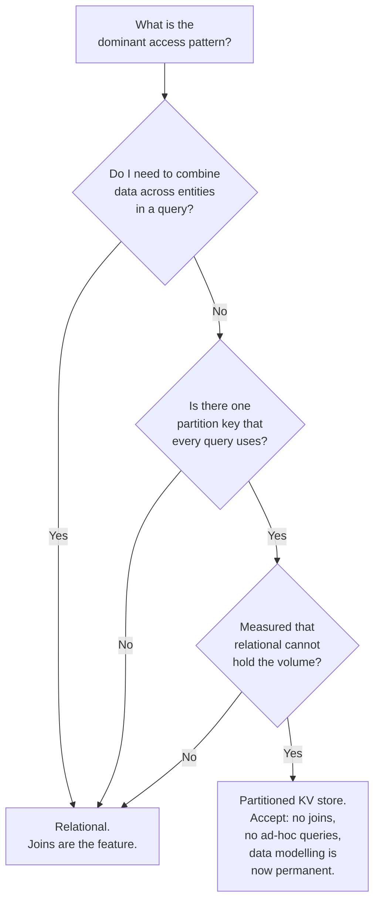

## The situation

New system, and someone has to pick the database. This is among the most
irreversible decisions available — data outlives code, and every consumer you
did not plan for will be reading it by the time you want to change.

## The default

**A relational database, almost certainly Postgres.** Then make every
alternative argue against it.

This is not conservatism for its own sake. A modern relational database gives
you, in one system with one operational model: transactions, joins, secondary
indexes, JSON documents with indexing, full-text search, geospatial queries,
range partitioning, logical replication, materialised views, and a
constraint system that catches data corruption before it happens.

Most "polyglot persistence" architectures are three specialised stores
approximating what one relational database already does, with three sets of
backups, three failure modes, and no cross-store transactions.

## When the default is genuinely wrong

| Signal | Consider | Not because |
|---|---|---|
| Write volume beyond what a single primary handles, with a natural partition key and no cross-partition transactions | Cassandra, DynamoDB, ScyllaDB | "Relational does not scale" — it scales far further than most teams reach |
| Data is genuinely a graph and queries are multi-hop traversals | Neo4j, or Postgres recursive CTEs first | Your data has foreign keys. All data has foreign keys. |
| Append-only time series at high cardinality, with retention and downsampling | Prometheus, Timescale, ClickHouse | You have a `created_at` column |
| Ranked full-text or vector search as the primary access pattern | OpenSearch, a vector store | You need a `LIKE` query |
| Working set fits in memory and you need microsecond reads | Redis, as a **cache** in front of the truth | Redis is faster (it is not a database of record unless configured very deliberately) |
| Analytical scans over billions of rows | A columnar warehouse, fed by CDC | Your reporting query is slow (add an index first) |

The right question for each row is: **have you measured the relational option
failing, or are you predicting it will?** Prediction is usually wrong by an
order of magnitude in the optimistic direction for relational databases.

## The questions that actually decide it

The bottom box is the honest cost of leaving relational: **your access patterns
become part of the schema.** A key-value store demands that you know every query
in advance, and a new query pattern means a new table and a backfill. That is
tolerable for a known workload and ruinous for a product still finding its
shape.

## Practical notes on the relational default

- **One database, many schemas** beats one database per service until you have
  a real isolation need. Splitting is easy; joining across a network is not.
- **Use the constraints.** Foreign keys, `NOT NULL`, `CHECK`, unique indexes. An
  application-enforced invariant is an invariant that will eventually be
  violated by a script somebody ran once.
- **Use managed hosting** unless you have a DBA. Backups, failover, patching,
  and point-in-time recovery are where self-hosting bills come due, and they
  come due during your worst week.
- **Test your restore**, not your backup. An untested restore is a hope.

## What it costs

The relational default has real ceilings, and pretending otherwise is how teams
end up doing an emergency migration under load. Single-primary write
throughput, connection count under high concurrency (use a pooler), and
multi-region write latency are genuine limits.

Know where your ceiling is *before* you approach it. "We can handle 20x current
write volume, and at 10x we start the sharding work" is a plan. "It has been
fine so far" is not.

## See also

- [Consistency Models](../consistency-models/)
- [Caching](../caching/)
- [The Boring Baseline](/docs/foundations/boring-baseline/)
