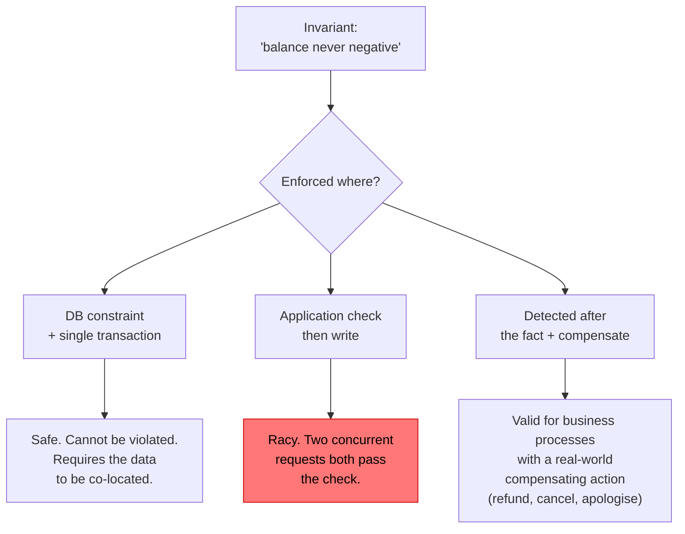

## The situation

Someone says "the data must be consistent" and everyone nods. Nobody has
defined consistent, and the requirement has quietly been interpreted as "every
read everywhere sees every write immediately," which is expensive, sometimes
impossible, and almost never what the business needs.

## The default

**Strong consistency inside a transactional boundary; eventual consistency
across boundaries.** Then find the specific invariants that must never be
violated and defend those explicitly.

The productive question is never "strong or eventual." It is: **what does the
user experience if this read is five seconds stale, and what does the business
lose?**

| Data | Staleness tolerance | Why |
|---|---|---|
| Account balance shown in UI | Seconds | It is already stale by the time it renders |
| Account balance used to authorise a withdrawal | Zero | This is the invariant |
| Product catalogue | Minutes | Nobody notices |
| Inventory count shown on a product page | Seconds to minutes | Oversell is a business process, not a bug |
| Inventory decrement at checkout | Zero, or compensating | Depends on whether you can back out |
| Permission revocation | Seconds, with a bounded worst case | Security review will ask for the bound |
| Analytics and reporting | Hours | It is aggregated anyway |
| Audit log | Zero loss, but ordering can be reconstructed | Durability matters more than freshness |

Notice the pattern: the same entity has different requirements depending on
what the read is *for*. Balance-for-display and balance-for-authorisation are
different reads with different needs. Designing both to the stricter
requirement is the standard, expensive mistake.

## The invariant question

For each rule the system must never break, ask where it is enforced.

The middle path — check then write, without a lock or constraint — is the most
common bug in production systems and it does not appear in testing because it
needs concurrency to manifest.

If you cannot put the invariant in a single transaction, you must choose the
third path deliberately: detect the violation and compensate. Airlines
overbook. Warehouses oversell. These are not failures of engineering; they are
business decisions to accept a violation rate in exchange for availability.

## Reading your own writes

The single most common user-visible consistency complaint: a user updates
something, the page reloads from a replica, and their change is gone.
They refresh, it appears. They file a bug.

Cheap fixes, in order of preference:

1. **Route a user's reads to the primary for a few seconds after their write.**
   Sticky by session, bounded by a timestamp.
2. **Return the new state in the write response** and have the client use it,
   rather than re-fetching.
3. **Pass a write timestamp / LSN** and have the read wait for a replica caught
   up past it.

Doing none of these and telling users to refresh is, unfortunately, also
common.

## When the default is wrong

Financial ledgers, inventory with legal implications, and anything where
"detect and compensate" has no real-world compensating action need genuine
serialisability and should keep the relevant data in one transactional store.
Do not distribute what must be atomic.

Conversely: at global scale with multi-region writes, strong consistency across
regions costs a cross-ocean round trip per write. Sometimes the right answer is
to partition so that each record has a home region and is strongly consistent
*there*.

## What it costs

Eventual consistency moves complexity from the database into the application
and, worse, into the user interface. Every screen has to answer "what do I show
while this is settling." Optimistic UI, pending states, and reconciliation
logic are real work that gets discovered late.

Budget for the UI cost when you choose eventual consistency. It is usually
larger than the backend cost.

## See also

- [Choosing a Datastore](../choosing-a-datastore/)
- [Caching](../caching/)
