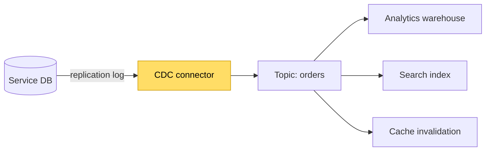
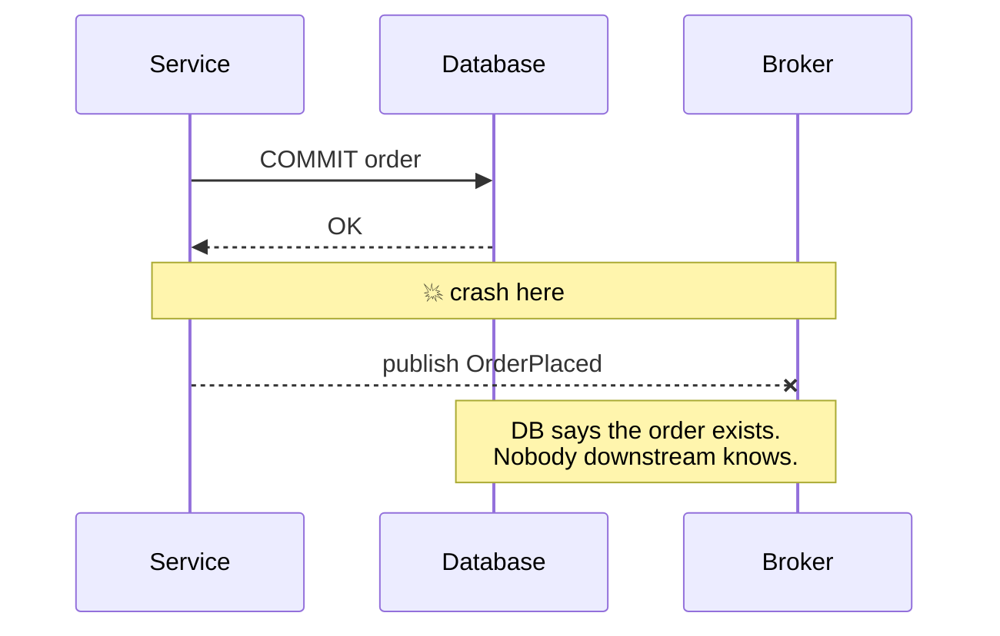

## The situation

Someone proposes "event sourcing" and the conversation immediately conflates
three separate things: storing state as a log of events, publishing events for
other services to consume, and streaming database changes downstream.

They have different costs and different payoffs. Separating them is most of the
work.

## The three things

| | Event sourcing | Event-driven integration | Change data capture |
|---|---|---|---|
| What it is | Your state **is** the event log; current state is a fold over it | Services publish domain events others subscribe to | Read the database's replication log, emit row changes |
| Source of truth | The event log | Each service's own store | The database |
| Who defines the schema | The domain | The publishing team, deliberately | The table structure, accidentally |
| Main benefit | Perfect audit trail, temporal queries, rebuild any projection | Decoupling, extensibility | Zero application change; get data out of a system you cannot modify |
| Main cost | Very high. Schema evolution on the log is forever | Moderate | Couples consumers to your physical schema |
| When it pays | Domains where history *is* the product: ledgers, trading, compliance | Most systems that have grown past two teams | Analytics pipelines, migrations, legacy integration |

## The default

**Use event-driven integration where you have publishers and consumers on
different teams. Use CDC to feed analytics. Do not use event sourcing unless
history is the product.**

That last one is a strong claim, so here is the reasoning: event sourcing makes
your event schema permanently load-bearing. You cannot fix a modelling mistake
from year one, because rebuilding state requires replaying events written under
the old model. You get versioned events, upcasters, and a growing pile of
translation code that must be correct forever.

For a ledger, an insurance policy system, or anything regulated where "what did
we know on 3 March and why" is a real question, that cost is worth paying —
often it is cheaper than the audit machinery you would otherwise build.

For a typical CRUD product, it buys you an audit log you could have gotten from
an audit table.

## CDC: the underrated one

Change data capture is the least fashionable of the three and the most
frequently correct. It reads the database's own replication stream (Postgres
logical decoding, MySQL binlog) and emits row-level changes.

What makes it valuable:

- **No application changes.** The service does not know it is happening.
- **No dual-write problem.** The write to the database and the emitted event
  cannot diverge, because the event *is derived from* the committed write. This
  solves the single hardest problem in event publishing.

What makes it dangerous:

- **Consumers become coupled to your physical schema.** Rename a column and you
  break the warehouse. This is the reason CDC output should feed an internal
  pipeline, not be published as a public contract.

If you want both — no dual-write *and* a clean public contract — the standard
answer is the **transactional outbox**: the service writes domain events to an
`outbox` table in the same transaction as the state change, and CDC (or a
poller) ships that table. The event schema is yours to design; atomicity comes
free.

## The dual-write problem, stated plainly

Without an outbox or CDC, publishing an event after a database commit has an
unfixable window:

No amount of retry logic closes this, because the crash can happen before the
retry loop starts. Every "we publish after commit" design has this bug; most
teams discover it during an incident rather than a review.

## When the default is wrong

- **Small system, one team, no consumers.** Skip all of it. An audit table and
  a nightly export is not technical debt at that size, it is proportionate.
- **You need to rebuild state at a past point in time for legal reasons.** Then
  event sourcing is not over-engineering; it is the requirement.

## What it costs

Any of these three adds a durable, schema-bearing, replayable stream to your
system that will outlive the reason you added it. Plan for: schema evolution on
messages, a dead-letter queue with an owner, replay tooling, and the
observability to answer "where is this message" at 3am.

The broker is a weekend. The operational maturity is a year.

## See also

- [Synchronous vs Asynchronous](/docs/system-design/sync-vs-async/)
- [Idempotency and Retries](/docs/system-design/idempotency-and-retries/)
