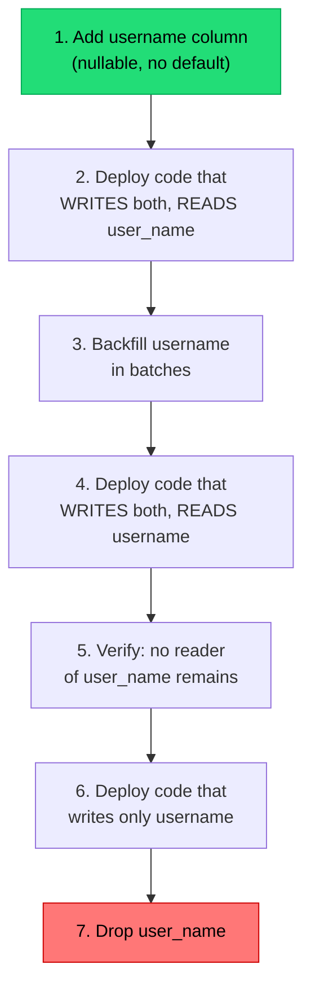

## The situation

You need to rename a column, split a table, add a constraint, or change a type.
During the deploy, old code and new code both run against the same database.
Whatever you do must be correct for both, simultaneously, in both directions —
because you might roll back.

## The default

**Expand, migrate, contract** — the same shape as
[API contracts](/docs/system-design/api-contracts/), applied to storage. Never
change a column in place.

Renaming `user_name` to `username`, done properly:



Seven deploys to rename a column. That is not overhead — that is what
correctness costs when you cannot stop the world. Each step is independently
safe to roll back, which is the property you are buying.

For a system that *can* take a maintenance window, one `ALTER TABLE` is fine.
Be honest about which you are.

## Operations that lock, and what to do instead

The failure most people meet first is not logical but operational: a migration
that takes a lock and stalls every query behind it.

| Operation | Danger | Safe approach |
|---|---|---|
| Add column with a non-null default | Table rewrite on older engines | Add nullable, backfill in batches, then set default |
| Add index | Locks writes | `CREATE INDEX CONCURRENTLY` (Postgres); online DDL (MySQL 8+) |
| Add `NOT NULL` | Full table scan under lock | Add a `CHECK … NOT VALID`, validate separately, then convert |
| Add foreign key | Locks both tables | `NOT VALID` then `VALIDATE CONSTRAINT` |
| Change column type | Rewrite | New column, dual-write, backfill, swap |
| Drop column | Breaks old code on rollback | Stop reading, deploy, wait a release, then drop |
| Long backfill in one statement | Holds a transaction open, bloats WAL, blocks vacuum | Batch it: 1000 rows, commit, sleep, repeat |

Also: **set a lock timeout on migrations.** A migration that waits for a lock
behind a long-running query, while new queries queue behind the migration, is
the classic way to take an outage with a change that "was just adding an
index."

```sql
SET lock_timeout = '3s';
SET statement_timeout = '30s';
```

Fail fast and retry, rather than blocking the world.

## Rules that prevent most incidents

- **Migrations deploy separately from code**, and always before it (for
  expands) or after it (for contracts). Coupling them into one artifact removes
  your ability to roll back one without the other.
- **Migrations are forward-only.** Down-migrations are a lie in production —
  you cannot un-drop data. Roll forward with a new migration.
- **Backfills are jobs, not migrations.** Restartable, rate-limited,
  observable, and safe to run twice.
- **Test the migration against a production-sized copy.** A migration that
  takes 200ms on 10,000 rows can take 40 minutes on 200 million.

## When the default is wrong

Small internal tools, pre-launch systems, and anything with a legitimate
maintenance window do not need seven steps. The ceremony is proportional to the
cost of downtime and the number of concurrent code versions. One deployable, no
users at 3am, and a two-minute window: just run the `ALTER`.

## What it costs

Dual-write periods mean the two columns can diverge if any writer is missed —
a background job, an admin script, a reporting ETL, a database trigger. Find
every writer before step 2, not during step 5.

Long-lived expand phases also accumulate: a codebase where six migrations are
stuck at "step 4 of 7" is confusing and each unfinished migration is a small
correctness hazard. Schedule the contract step when you start the expand.

## See also

- [API Contracts and Versioning](/docs/system-design/api-contracts/)
- [Rollback Is a Feature](/docs/delivery/rollback/)
