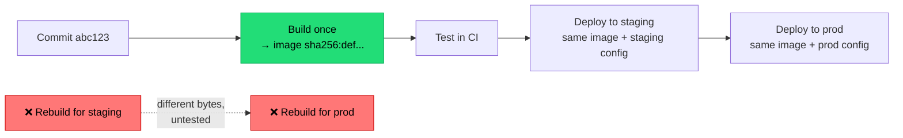

## The situation

Production is broken. You want to know what changed. The answer should be a
commit SHA and a diff. Too often it is "well, the build pulled `latest` on
Tuesday, so it might be a transitive dependency."

Reproducibility is not purity for its own sake. It is the property that makes
debugging, rollback, and incident forensics possible at all.

## The default

**One artifact, built once, identified by content, promoted unchanged.**

| Rule | What it prevents |
|---|---|
| Pin every dependency to an exact version, with a lockfile committed | A transitive dependency changing under you between builds |
| Pin base images by digest, not tag | `node:20` being a different image next week |
| Tag artifacts with the commit SHA, not `latest` | Ambiguity about what is deployed |
| Never rebuild for a different environment | The tested artifact differing from the shipped one |
| Inject configuration at deploy time | Config baked into the image forcing a rebuild |
| Record the build inputs (SHA, dependency versions, builder image) in the artifact | "What was in this?" being unanswerable |

The digest-pinning rule is the one most often skipped, and it defeats most of
the others. `FROM ubuntu:22.04` is not a pin — that tag moves.

## Promotion, not rebuilding

Promotion is a metadata change — "this digest is now approved for prod" — not a
build. If your deploy step contains a build command, you are shipping something
you did not test.

## How far to take reproducibility

There is a spectrum, and most teams should stop partway:

1. **Pinned and deterministic-ish** — lockfiles, digest-pinned bases, SHA tags.
   Rebuilding produces functionally identical output. **This is the level
   almost everyone should reach.**
2. **Bit-for-bit reproducible** — same inputs produce byte-identical output.
   Requires eliminating timestamps, file ordering, absolute paths, and build IDs.
   Real work, real tooling (Nix, Bazel).
3. **Independently verifiable** — multiple parties rebuild and compare.

Level 2 matters if you distribute binaries users must trust, ship to
air-gapped or regulated environments, or are a supply chain target. For a
typical internal web service, level 1 gets you the debugging and rollback
benefits at a fraction of the cost.

Be honest about which you need. Level 2 is a project, not a task.

## Provenance

Once builds are pinned, the natural next step is recording *where an artifact
came from* in a way that survives: which commit, which pipeline run, which
builder, which dependencies. SLSA provenance and SBOM generation are the
standard forms.

This is cheap to add at build time and impossible to reconstruct later. Do it
before you need it — the moment you need it is an incident.

See [Supply Chain Integrity](/docs/security/supply-chain/) for the security
side of this.

## When the default is wrong

Nothing here is wrong exactly, but the effort should be proportionate. A
prototype that will not exist in three months does not need digest pinning and
provenance attestation. A one-line internal tool does not need Bazel.

The trigger for taking it seriously: **the first time you cannot answer "what
exactly is running in production."**

## What it costs

Pinned dependencies do not update themselves, so you need automated dependency
update PRs (Dependabot, Renovate) or you will silently accumulate known
vulnerabilities while feeling secure about your reproducibility.

That is the real trade: pinning moves you from "unpredictable updates" to
"predictable staleness." The second is much better, but only if you have a
process for the staleness.

## See also

- [Pipeline Design](../pipeline-design/)
- [Supply Chain Integrity](/docs/security/supply-chain/)
