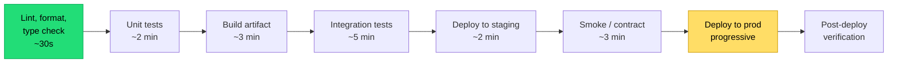

## The situation

The pipeline takes 45 minutes. People stop watching it. They merge and walk
away. Failures are discovered hours later by whoever notices, context is gone,
and the fix is a scramble.

Pipeline duration is not a convenience issue — it directly sets how large a
batch people are willing to work in, which sets how risky each change is.

## The default

**Order stages by (probability of catching a failure) ÷ (time to run).** Cheap,
high-yield checks first; expensive, low-yield checks last.

Targets that matter more than the exact stages:

- **Under 10 minutes to a merge decision.** Beyond that, people context-switch
  and the feedback loop is broken.
- **Under 5 minutes for the pre-merge portion**, ideally.
- **Deterministic.** A flaky pipeline is worse than a slow one, because it
  trains the team to re-run instead of investigate.

## Build once, promote the artifact

The single most important structural rule:

> Build the artifact **once**, then promote the *same bytes* through
> environments.

Rebuilding per environment means the thing you tested is not the thing you
shipped. Environment-specific behaviour comes from configuration injected at
deploy time, never from a different build.

This also means the artifact must not embed environment config. If your Docker
image has a `config.staging.yaml` baked in, you are rebuilding per environment
with extra steps.

## Killing flakiness

Flaky tests are the primary cause of pipeline decay, and the usual response —
re-run on failure — makes it permanent by removing the pain that would drive a
fix.

What works:

- **Quarantine, do not retry silently.** A flaky test moves to a
  non-blocking suite immediately, with a ticket and an owner. It is either
  fixed within a sprint or deleted.
- **Track flake rate as a number** that someone reports on. Invisible problems
  do not get fixed.
- **Ban time-based waits.** `sleep(2)` in a test is a flake with a delay fuse.
  Wait for conditions.
- **Isolate test data.** Shared fixtures across parallel tests are the most
  common root cause.

A test suite you do not trust provides negative value: it costs time and
teaches the team to ignore red.

## Slow gates that belong later

Not everything needs to block a merge. These usually belong after merge, or on
a schedule:

| Check | Where |
|---|---|
| Full end-to-end browser suite | Post-merge, or nightly |
| Performance / load regression | Nightly against staging |
| Dependency vulnerability scan | Daily, plus on dependency change |
| Container image scan | On build, blocking only for critical severity |
| Infrastructure plan review | On infra change only |
| Mutation testing | Weekly, informational |

The principle: block the merge on things that are *likely to be broken by this
change and fast to check*. Everything else runs where it does not cost every
engineer ten minutes.

## When the default is wrong

Safety-critical, regulated, or on-premise-shipped software has gates that must
block regardless of duration — and the correct response is to make them
parallel and provisioned, not to move them. A four-hour certification suite for
medical device firmware is not pipeline decay; it is the job.

## What it costs

Fast pipelines cost money: parallel runners, test sharding, caching
infrastructure, and someone maintaining it. That budget is easy to cut because
its benefit is diffuse.

The counter-argument that lands with finance: pipeline minutes are cheaper than
engineer minutes by roughly two orders of magnitude. Ten engineers waiting five
extra minutes per merge, several merges a day, is a meaningful fraction of a
headcount per year.

## See also

- [Trunk-Based Development](../trunk-based-development/)
- [Build Reproducibility](../build-reproducibility/)
