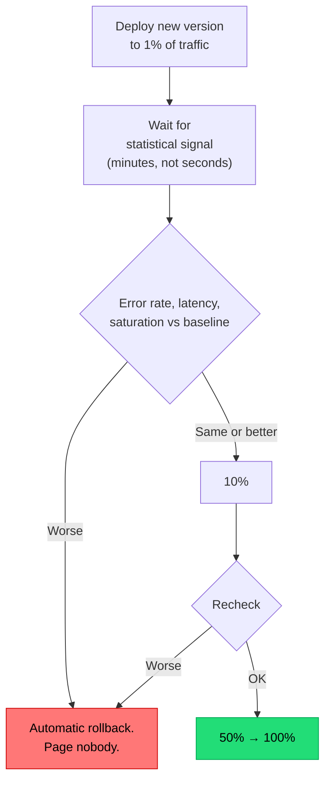

## The situation

A deploy either works or it takes down production for everyone at once. That
binary is a choice, not a law — and it is the choice that makes releases scary,
which makes them rare, which makes them bigger, which makes them scarier.

## The default

**Separate deploy from release.** Deploying puts code on servers. Releasing
exposes behaviour to users. Once these are separate events, every release
becomes a dial rather than a switch.

The three mechanisms, and what each is actually for:

| Mechanism | What it varies | Best for | Weak at |
|---|---|---|---|
| **Blue-green** | Which environment serves traffic | Fast, complete rollback; big-bang cutover | Cost (2x infra); database schema must serve both |
| **Canary** | What fraction of traffic hits the new version | Catching failures with real traffic before full exposure | Needs enough traffic for signal; needs automated analysis |
| **Feature flags** | Which users see which behaviour | Per-user targeting, instant off switch, decoupling from deploy | Code complexity; flags must be cleaned up |

They compose. A mature setup deploys with blue-green or rolling update, shifts
traffic as a canary, and gates the actual behaviour behind a flag.

## Canary that works

A canary without automated analysis is just a slower deploy that nobody is
watching.

Required for this to mean anything:

- **Compare against a concurrent baseline**, not against yesterday. Traffic
  patterns change hourly; comparing new-at-2pm to old-at-2am proves nothing.
- **Enough traffic in the canary window** to detect the effect size you care
  about. Low-traffic services cannot canary meaningfully — use flags instead.
- **Automatic rollback.** If a human has to decide, the canary only works
  during office hours.
- **Metrics that reflect users**, not just infrastructure. CPU looking fine
  while checkout success rate drops 4% is the exact failure canaries exist to
  catch.

## Flags as the finest-grained control

Flags are the only mechanism that can target *specific users* — internal staff
first, then beta customers, then a percentage, then everyone. That progression
catches a category of bug that percentage-based canaries miss: problems that
only appear for a specific data shape or account configuration.

The discipline is covered in
[Trunk-Based Development](../trunk-based-development/): every release flag gets
an owner and a removal date, or you accumulate permanent complexity.

## When the default is wrong

- **Low-traffic internal services.** Canary analysis on 12 requests per minute
  is noise. Deploy, watch, roll back manually — that is proportionate.
- **Batch jobs and workers.** There is no "traffic" to split. Progressive
  delivery here means running the new version on a subset of partitions or a
  shadow run against real input with output discarded.
- **Stateful systems and databases.** You cannot canary a schema migration.
  This is why [expand/contract](/docs/data-and-state/zero-downtime-migrations/)
  exists — it is the progressive delivery pattern for data.

## What it costs

Blue-green doubles infrastructure during cutover. Canary requires traffic
splitting (service mesh, load balancer rules, or platform support) plus a
metrics pipeline with enough fidelity for automated decisions. Flags add branch
complexity to the codebase and a configuration surface that can itself cause
incidents.

The bigger hidden cost: during any progressive rollout, **two versions of your
code are live simultaneously**, sharing one database and one message stream.
Every change must be compatible with the version it is replacing, in both
directions. Teams adopt canary deploys and then are surprised by this. It is
not a side effect — it is the same discipline that makes trunk-based
development and zero-downtime migration work, applied at the deploy layer.

## See also

- [Rollback Is a Feature](../rollback/)
- [SLOs and Error Budgets](/docs/reliability/slos-and-error-budgets/)
