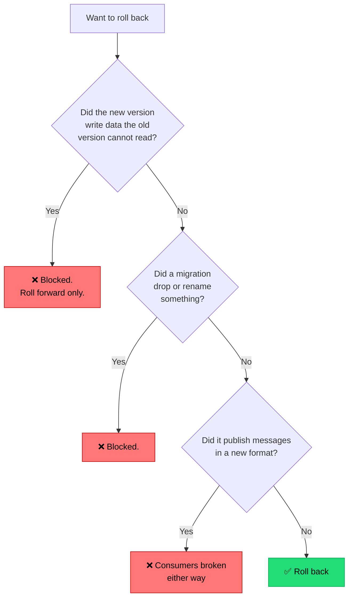

## The situation

Something is wrong in production. The fastest path to a working system is
almost always to go back to the last thing that worked. Whether you can do that
in two minutes or two hours was decided weeks earlier, by design choices nobody
labelled as being about rollback.

## The default

**Every change ships with a known, tested way to undo it — and the undo path is
exercised, not theoretical.**

Ranked by speed:

| Mechanism | Time to recover | Constraint |
|---|---|---|
| Flip a feature flag off | Seconds | Behaviour must be behind a flag |
| Shift traffic back (canary / blue-green) | Under a minute | Previous version still running |
| Redeploy the previous artifact | Minutes | Artifact retained; config compatible |
| Revert the commit and rebuild | 10–30 minutes | Pipeline is fast and green |
| Restore from backup | Hours | Data loss between backup and now |
| Manual data repair | Unbounded | You are writing SQL under pressure |

The design goal is to keep as many incidents as possible in the top three rows.
The bottom two are not rollback; they are disaster recovery, and they mean
something upstream failed.

## What blocks rollback

Rollback fails for predictable reasons. All of them are decisions made earlier:

Every blocked branch is an
[expand/contract](/docs/data-and-state/zero-downtime-migrations/) violation.
This is the deep reason the expand/contract discipline matters: it is not
pedantry about migrations, it is what keeps the undo button connected.

## Roll forward vs roll back

There is a real school of thought that says always roll forward — fix and
deploy rather than revert. It is right in one situation and wrong in the rest.

- **Roll back** when you do not yet understand the failure. Restore service
  first, investigate second. This is the default under pressure, because
  diagnosis under load makes bad decisions.
- **Roll forward** when the failure is understood, the fix is small and
  obvious, and rolling back is blocked by one of the branches above.

"We always roll forward" is often a rationalisation of "we cannot roll back."
If that is the situation, name it as a gap rather than a philosophy.

## Practices that keep the undo path alive

- **Retain the previous N artifacts** and keep the previous version's
  infrastructure warm long enough to shift back.
- **Practise it.** A rollback that has not been executed in three months is a
  hypothesis. Do it deliberately in a low-traffic window.
- **Make it one command or one button**, runnable by whoever is on call,
  without needing the author of the change.
- **Document what cannot be rolled back**, per change, before it ships. If a
  deploy is one-way, that should be stated in the PR, not discovered at 3am.
- **Automate it** where you can: canary analysis that rolls back without a human
  is the difference between a 90-second blip and a 40-minute incident.

## When the default is wrong

Some changes genuinely cannot be undone: a destructive migration executed
deliberately, a message sent to customers, a payment settled, an external
system notified. For these, the protection is not rollback but a **gate before
the irreversible step** — a confirmation, a dry run, a staged rollout with a
small blast radius.

Know which of your operations are one-way, and treat them with different
ceremony.

## What it costs

Preserving rollback capability constrains what you can do in a single change.
You cannot rename the column and update the code in one deploy. You cannot
change the message format and the consumer at once. Every change gets slightly
longer and slightly more procedural.

That is the trade: a little friction on every change, in exchange for the worst
incident being minutes instead of hours. Given how the costs distribute, it is
usually a good trade — but it is a trade, and teams that have never had a bad
incident tend to undervalue it.

## See also

- [Progressive Delivery](../progressive-delivery/)
- [Incident Response](/docs/reliability/incident-response/)
