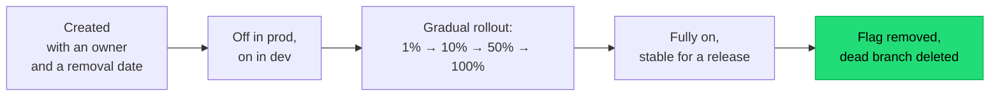

## The situation

The branching model argument is usually framed as a workflow preference. It is
not — it is an architecture decision about batch size, and batch size
determines how bad your worst deploy can be.

A branch that lives for three weeks is three weeks of unintegrated,
unvalidated, unreviewed-in-context change. The merge conflict is the visible
cost. The invisible cost is that nobody knows whether the combined system works
until the moment it all lands.

## The default

**Trunk-based development**: short-lived branches (hours to two days), merged
to main, with main always releasable.

The mechanisms that make this safe are not optional:

| Mechanism | Why it is required |
|---|---|
| **Feature flags** | Lets you merge incomplete work without exposing it. Without flags, trunk-based means shipping half-features |
| **Fast CI** | If the pipeline takes 40 minutes, people batch changes to avoid waiting, and you are back to large batches |
| **Expand/contract everywhere** | Merging continuously means old and new code coexist constantly |
| **Real test coverage on the critical paths** | Main must be releasable; that claim needs evidence |
| **Small, reviewable PRs** | A 2000-line PR gets a rubber-stamp review regardless of policy |

Feature flags are the load-bearing one. Trunk-based development without flags
is just a rule that makes people uncomfortable.

## Why not GitFlow

GitFlow was designed for versioned software shipped to customers who install
it — where you genuinely maintain multiple released versions simultaneously.
For a continuously deployed web service, it adds develop/release/hotfix
branches that model a release process you do not have.

If you ship to production several times a week, most of GitFlow's structure is
ceremony around a problem you do not have. If you ship a versioned on-premise
product with supported older releases, GitFlow (or something like it) is
solving a real problem.

Ask which you are before picking.

## The flag lifecycle

Flags are the mechanism, and they are also the mess. Treat each one as having
a life:

Without step E, flag count grows without bound, the number of theoretically
reachable code paths grows exponentially, and eventually nobody dares delete
one because they cannot prove it is unused.

Enforce it: a flag older than 90 days fails a lint or opens a ticket
automatically. Report the count. Make it visible.

Also distinguish **release flags** (temporary, deleted after rollout) from
**operational flags** (permanent kill switches, circuit breakers, tenant
config). Only the first kind should expire.

## When the default is wrong

- **Open-source projects with untrusted contributors.** Pull requests from
  forks with review gates are the point.
- **Regulated environments requiring segregation of duties**, where the person
  who writes cannot be the person who releases. Trunk-based still works, but
  the release step is separate and gated.
- **Very large refactors** that genuinely cannot be flagged — a build system
  migration, a language version bump. Use a branch, keep it rebased daily, and
  treat the duration as a risk to actively manage rather than accept.

## What it costs

Trunk-based development transfers risk from merge time to runtime. You merge
more often, so integration is cheap — but incomplete code is now in production
behind flags, and a flag misconfiguration is a production incident.

It also demands more of the test suite and more discipline in review. Teams
without either will ship breakage to main and lose the "always releasable"
property, at which point they have the costs of both models.

## See also

- [Pipeline Design](../pipeline-design/)
- [Progressive Delivery](../progressive-delivery/)
