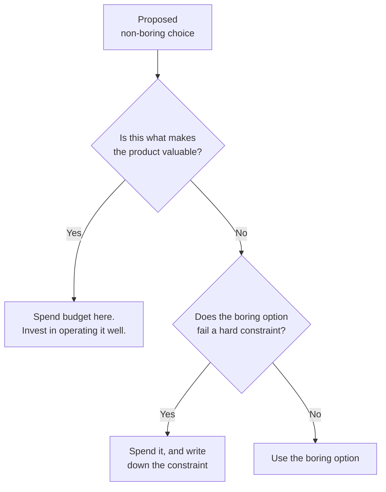

## The situation

Every new system starts with a choice you make before you notice you are making
it: how much novelty to accept. Novelty is not just new technology — it is any
component the team has not operated before, including a familiar technology
used in an unfamiliar way.

Novelty has a budget. Most teams spend it on the wrong things.

## The default

The boring baseline, roughly, for a system with real users and a team under
twenty people:

- **One relational database** (Postgres unless something specific says
  otherwise). Not one per service — one, until proven otherwise.
- **A monolith or a small number of coarse services**, split along team
  boundaries rather than noun boundaries.
- **Synchronous HTTP** between them, with timeouts and retries, until you have
  a concrete reason for a broker.
- **Managed everything** you can afford: database, queue, object store, TLS,
  identity.
- **One deployment mechanism**, used identically in every environment.
- **Logs, metrics, and a trace ID** from day one. Nothing more exotic.
- **Feature flags** early, because they buy back reversibility cheaply.

This is not a claim that boring is always right. It is a claim about where the
burden of proof lies: **novelty must justify itself against this baseline, not
the other way around.**

## Spending the novelty budget

You get roughly one or two genuinely novel things per system before operational
load exceeds what the team can absorb. Spend them where the novelty is the
product — the thing that makes your system worth building.

The second branch matters. "Postgres will not handle our write volume" is a
constraint if you have measured it, and résumé-driven development if you have
not.

## When the default is wrong

Three cases where boring is genuinely the wrong call:

- **The boring option has a known cliff you will hit inside the planning
  horizon.** Choosing something you will definitely outgrow in nine months to
  save two weeks now is not pragmatism, it is a scheduled migration.
- **The team's existing expertise is in the "exotic" option.** Boring is
  relative to the team, not to the industry. A team of Erlang veterans building
  on the JVM for its "boringness" has it backwards.
- **Regulatory or physical constraints rule it out.** Data residency,
  air-gapped deployment, and hard real-time requirements are not preferences.

## What it costs

Boring architectures are unglamorous to work on, and that has a real hiring and
retention cost that people are reluctant to say out loud. Some engineers join
to work on interesting problems, and "we run a Rails monolith on RDS" is not a
recruiting pitch.

The counter is to make the *problem* interesting rather than the stack. Teams
that keep their infrastructure dull and spend the saved effort on the domain
tend to both ship more and lose fewer people than teams doing the reverse — but
this is a real trade-off, not a free lunch.

The other cost: boring baselines can ossify into "we do not evaluate new
things", which is how a team ends up on an unsupported runtime with no upgrade
path. Boring means *proven*, not *frozen*.

## See also

- [Irreversible Decisions](../irreversible-decisions/)
- [Choosing a Datastore](/docs/data-and-state/choosing-a-datastore/)
- [Kubernetes: What You Sign Up For](/docs/platform/kubernetes-reality/)
