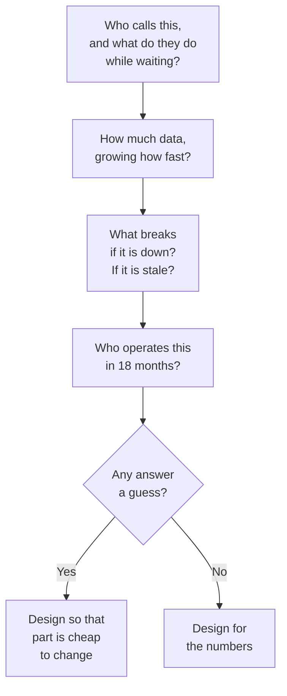

## The situation

You get a requirements document, a ticket, or a conversation that starts with
"we need a service that…". Whatever it says, it is describing a *solution
someone already imagined*, not the constraints that make a solution correct.

Designing against stated requirements without finding the real constraints is
the most common way to build something technically excellent and operationally
useless.

## The default

Before drawing anything, get numbers for these. Guessed numbers with an order
of magnitude are fine. No numbers is not fine.

| Constraint | The question to ask | Why it dominates |
|---|---|---|
| Load shape | Peak vs average, and how spiky | Determines whether you need queueing, autoscaling, or nothing |
| Data volume and growth | Rows today, rows in 2 years | Decides the datastore, not the query pattern |
| Latency budget | What does the caller do while waiting | The difference between sync and async is decided here |
| Consistency need | What breaks if a read is 5 seconds stale | Usually far weaker than people first claim |
| Failure tolerance | What happens if this is down for an hour | Distinguishes "add a retry" from "add a region" |
| Team | How many people, what do they already run | The single most-ignored constraint |
| Compliance | Where can this data live, who can see it | Cannot be retrofitted |
| Money | What is the budget, per month | Turns "just use managed" into a real trade-off |

The team constraint deserves emphasis. An architecture that requires expertise
your team does not have and cannot hire is not an architecture, it is a plan to
be rescued by consultants.

## When the default is wrong

Sometimes the constraint set is genuinely unknown — a new product, no users, no
load data. Do not fake precision. Instead:

- Design for the **shape** you can predict, not the magnitude. "Read-heavy with
  bursty writes" is a design input even without numbers.
- Pick the option with the widest range of acceptable outcomes rather than the
  one optimal for a guessed number.
- Make the parts you are guessing about the cheapest to change.

This is the one situation where deliberate over-simplicity wins. The system you
build before you have users exists to *get* you users, and its main job is to be
easy to throw away.

## What it costs

Constraint gathering is unpopular because it looks like delay and it surfaces
disagreement. You will discover that the product manager and the compliance
lead have incompatible assumptions, and that will now be your problem for a
week.

That week is the cheapest it will ever be. The same disagreement discovered
after launch costs a migration.

## A one-hour version

If you have no time for a proper discovery process:

Four questions. Most bad designs fail one of them obviously, in the first
conversation, before anyone has written code.

## See also

- [Trade-off Sliders](../trade-off-sliders/) — naming what you buy with each constraint.
