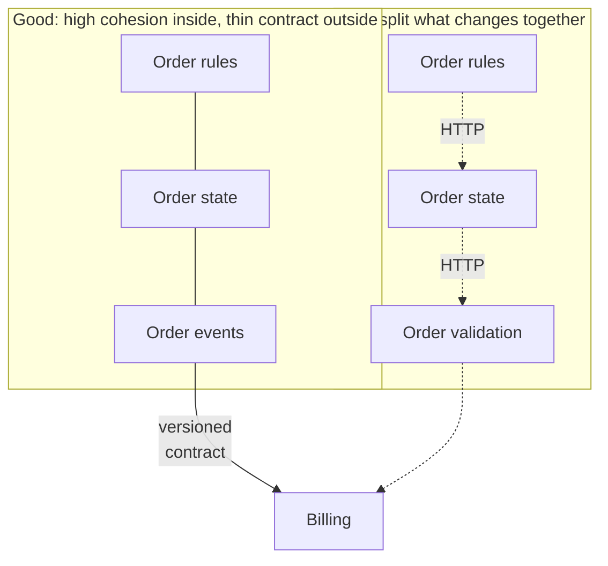

## The situation

Two things are coupled when changing one forces you to change the other. That
definition is uselessly abstract until you attach it to concrete pain: a
deployment that must be ordered, a schema change that breaks a team you have
never met, a test suite that cannot run without six containers.

Every architecture pattern in existence — layering, microservices, events,
hexagonal, whatever — is an attempt to control *which* things are coupled and
*how*. Learning to name the coupling type is more useful than learning the
patterns.

## The default

Prefer, in order:

1. **No coupling** — the two things genuinely do not need to know about each
   other. Check this first; a surprising amount of coupling is accidental.
2. **Data coupling** — one passes the other exactly the values it needs.
3. **Contract coupling** — both depend on an explicit, versioned interface that
   changes on a published schedule.
4. **Temporal coupling** — one must be up when the other runs.
5. **Shared-state coupling** — both read and write the same storage.

The line worth defending is between 3 and 4. Contract coupling lets two teams
move independently. Temporal and shared-state coupling do not, no matter how
many services you split things into.

## The kinds you will actually meet

| Type | Looks like | Cost | Usual fix |
|---|---|---|---|
| **Shared database** | Two services writing the same tables | Schema is now a public API nobody versioned | One writer per table; others read via API or replica |
| **Deployment ordering** | "Deploy B before A" | Every release is a coordination meeting | Backward-compatible contracts, expand/contract |
| **Distributed transaction** | Two systems must both succeed | Failure modes multiply, recovery is manual | Sagas, idempotency, accept eventual consistency |
| **Shared library with business logic** | Bump the version everywhere at once | A monolith with extra build steps | Share plumbing, not domain rules |
| **Chatty synchronous calls** | A calls B calls C in one request | Latency and failure compose badly | Denormalise, cache, or invert to events |
| **Semantic coupling** | Same field, two meanings, one is wrong | Silent data corruption, found months later | Explicit shared vocabulary; see [ADRs](/docs/knowledge/adr/) |

Semantic coupling is the nastiest because no tool detects it. Two teams both
have a field called `status` and they disagree about what `"active"` means. The
build passes. The reports are wrong.

## When to accept high coupling

Deliberately, and locally. Things that change together should live together —
that is what cohesion means, and it is not the opposite of low coupling, it is
the mechanism that makes low coupling possible.

If two modules always change in the same commit, splitting them across a
network boundary does not decouple them. It converts a compile error into a
production incident.

## What it costs

Reducing coupling is not free. Every seam you add costs indirection, a
serialisation format, a failure mode, and a place for the two sides to drift
apart. A codebase optimised for zero coupling everywhere is unreadable — you
cannot follow a single behaviour through six interfaces and a message bus.

The goal is not minimal coupling. It is coupling that matches how the system
actually changes. Where two things change together, couple them tightly and
keep them close. Where they change independently, invest in the seam.

## See also

- [Service Boundaries](/docs/system-design/service-boundaries/) — applying this at the service level.
- [Trade-off Sliders](../trade-off-sliders/)
