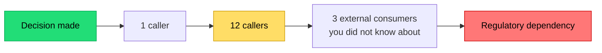

## The situation

Someone asks "is this an architecture decision or just an implementation
detail?" The honest answer is usually a question back: **how much would it cost
to undo in six months?**

That is the only definition that has held up in practice. Not "is it drawn on
the diagram", not "did an architect approve it", not "does it span services".
Cost of reversal.

## The default

Sort every decision into one of two buckets before you spend time on it.

| | Cheap to reverse | Expensive to reverse |
|---|---|---|
| Examples | Log format, retry count, internal function structure, which HTTP client library | Datastore choice, public API shape, tenancy model, sync vs async between two teams, auth model |
| How to decide | Pick one, ship it, move on | Write it down, get disagreement out early, prototype the risky part |
| Who decides | Whoever is touching the code | The people who will maintain the consequences |
| Failure mode | Bikeshedding a nothing decision | Deciding by accident, in a PR, on a Friday |

The two failure modes are symmetrical and both common. Teams burn a week
arguing about a logging library and then pick their primary datastore because
one person already knew it.

## When the default is wrong

Reversal cost is not fixed — it is a function of how much has been built on
top. The same decision is cheap on day one and ruinous on day 400.

This means **timing matters more than correctness**. A merely-adequate decision
made while reversal is still cheap beats a perfect decision made after three
teams have built on the wrong assumption.

It also means the reverse: if you can genuinely defer a decision without
blocking work, defer it. Not out of indecision — because the information you
need arrives later, and reversal is cheapest before commitment.

## What it costs

The failure mode of taking this seriously is *decision theatre*: every trivial
choice gets a document, a review, and a two-week delay. That is worse than the
disease. A useful heuristic — if you cannot name a specific person who will be
harmed by getting it wrong, it is not an architecture decision.

The other cost is that "expensive to reverse" is often a self-fulfilling
prophecy. Decisions become irreversible because nobody bothered to keep an
abstraction seam. A repository interface, a versioned API, an anti-corruption
layer at an integration point — these are not architecture astronautics when
placed at genuinely uncertain boundaries. They are cheap options on being
wrong.

Put the seam where you are uncertain. Do not put a seam everywhere; that is how
you get twelve layers of indirection around a decision nobody was ever going to
change.

## Signals you are in an irreversible decision

- More than one team will write code against it.
- It appears in a data model that will accumulate rows.
- It shows up in a URL, a message schema, or anything a customer can see.
- Undoing it would require a data migration, a coordinated deploy, or a
  customer-visible change.
- Someone says "we can always change it later" without saying how.

That last one is the most reliable signal in the list.

## See also

- [Constraints First](../constraints-first/) — where the real limits come from.
- [Architecture Decision Records](/docs/knowledge/adr/) — how to record one so it survives.
