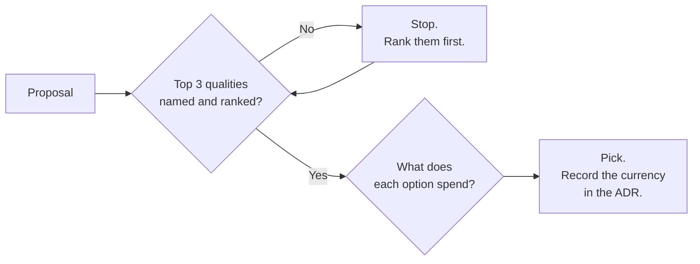

## The situation

Someone proposes a design and someone else objects. The argument goes in
circles because both people are optimising for different qualities and neither
has said which one.

The fix is boring and works: force the trade-off to be named out loud, in
advance, with a ranking. Not "we value all of these" — a ranking.

## The default

Pick the top three, in order, before evaluating options. Write them down. The
rest are constraints to satisfy, not goals to maximise.

| Quality | What you give up to get it |
|---|---|
| **Time to market** | Operability, cost efficiency, sometimes correctness |
| **Correctness / consistency** | Latency, availability, throughput |
| **Availability** | Consistency, cost, simplicity |
| **Latency** | Cost, consistency, operational simplicity |
| **Cost efficiency** | Headroom, latency, engineering time |
| **Operability** | Time to market, novelty, developer freedom |
| **Security posture** | Developer velocity, latency, cost |
| **Flexibility / optionality** | Simplicity, performance, time to market |
| **Simplicity** | Almost everything else, later |

The value of the table is not the pairings — those are debatable. It is that
having a list in front of two arguing engineers converts an unfalsifiable
argument into a resolvable one.

## Doing it in a review

A design review that produces "looks good to me" produced nothing. One that
produces *"we are buying availability with consistency, and here is where that
shows up for the user"* has done its job.

## When the default is wrong

Rankings are situational and expire. The ranking that was right during a launch
push (time to market first) is actively harmful eighteen months later when the
same team is drowning in the operability debt they knowingly took on.

Revisit the ranking when the phase changes: pre-product-market-fit, scaling,
maturity, and sunset are four different rankings for the same system. A team
that never re-ranks ends up defending decisions with reasons that stopped being
true two years ago.

## What it costs

Explicit trade-offs create accountability, which people avoid. Saying "we chose
speed over operability" in writing means someone can point at it during the
incident review. That discomfort is the entire point — it is also why teams
quietly resist the practice.

The other cost is false precision. These qualities are not measurable on a
common scale, and pretending otherwise (weighted scoring matrices with made-up
numbers) produces confident nonsense. Rank them; do not score them.

## See also

- [Constraints First](../constraints-first/)
- [The Boring Baseline](../boring-baseline/)
- [ADRs](/docs/knowledge/adr/) — where the ranking gets recorded.
