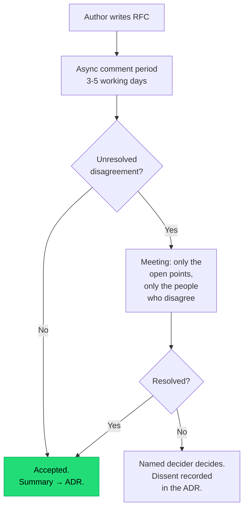

## The situation

A design gets built, shipped, and then somebody senior says "wait, this
conflicts with what the payments team is doing." That objection existed at
design time. It did not surface because there was no forum, or because the
forum was a meeting where nobody wanted to be the one slowing things down.

The purpose of a design review is not approval. It is **making disagreement
cheap and early**.

## The default

**Written proposal, asynchronous comment period, then a meeting only if
unresolved.**

The written document does most of the work. Writing a design down forces
precision that a conversation allows you to skip, and roughly a third of
proposals get materially improved by the author during the writing, before
anyone else reads them.

A workable template:

```markdown
# RFC: <title>

Author, date, status (draft / in review / accepted / rejected / superseded)
Reviewers: <named people, not "the team">

## Problem
What is broken or needed. Include the evidence — numbers, incidents,
customer requests. If you cannot state the problem without describing
the solution, you do not have the problem yet.

## Constraints
Deadline, team size, existing systems, compliance, budget.
(See /docs/foundations/constraints-first/)

## Proposal
What you intend to build. Diagrams at one level of abstraction.

## Alternatives considered
At least two, each with why it was rejected. "Do nothing" is always
one of them.

## Trade-offs
What this buys and what it spends. Name the qualities explicitly.
(See /docs/foundations/trade-off-sliders/)

## Risks and open questions
The parts you are least sure about. Be honest — this is where reviewers
add the most value.

## Rollout and rollback
How this gets deployed and how it gets undone.
```

The "Risks and open questions" section is the one that determines whether the
review is useful. An RFC presenting a fully-confident design invites
rubber-stamping. One that says "I am not sure about the failure behaviour here"
directs expert attention exactly where it is needed.

## Making disagreement safe



Two things make this work:

- **A named decider, agreed in advance.** Design by consensus stalls on the
  first genuine disagreement, and stalling is usually worse than either option.
  Someone decides; the dissent is recorded rather than suppressed.
- **Recorded dissent.** "The payments team disagreed with this and expected X to
  be a problem" is enormously valuable eighteen months later, whether or not X
  turned out to be a problem.

## Scoping who reviews

Reviewing everything is how review processes die. Scope by
[irreversibility](/docs/foundations/irreversible-decisions/):

| Scope | Review |
|---|---|
| Inside one team, reversible | Code review, no RFC |
| Inside one team, hard to reverse | RFC, reviewed within the team |
| Affects another team's contract | RFC, that team is a named reviewer |
| Cross-cutting: security, data model, platform | RFC, plus the relevant specialist |
| New external dependency or vendor | RFC, plus whoever owns the commercial and security review |

Naming specific reviewers rather than broadcasting to a channel matters. A
document sent to everyone is reviewed by nobody.

## Anti-patterns

- **Review as gate rather than as improvement.** If the outcome is always
  "approved" the process is theatre; if it is frequently "rejected after weeks"
  the review is happening too late.
- **Reviewing a design that is already built.** Common, demoralising, and
  guarantees that feedback is ignored. Review before implementation starts, or
  do not review.
- **Bikeshedding.** Reviewers commenting on naming and formatting while the
  consistency model goes unexamined. The template's Risks section helps direct
  attention.
- **No time limit.** An RFC open for six weeks is blocking someone. Publish the
  comment window and close it.

## When the default is wrong

Small teams working closely do not need a written RFC for every design; a
conversation and an [ADR](../adr/) afterwards captures the same value with less
process.

Urgent work sometimes has to skip review. That is legitimate, and the honest
version is to write the RFC afterwards, marked as retrospective, so at least
the reasoning is recorded.

## What it costs

An RFC is a day of writing plus a week of latency. For decisions that turn out
to be easy, that is pure overhead — and you cannot always tell in advance which
those are.

The mitigation is proportionality: a one-page RFC for a medium decision is
fine, and the process should explicitly permit it. A template that demands ten
sections for every change trains people to route around the process entirely.

## See also

- [Architecture Decision Records](../adr/)
- [Trade-off Sliders](/docs/foundations/trade-off-sliders/)
