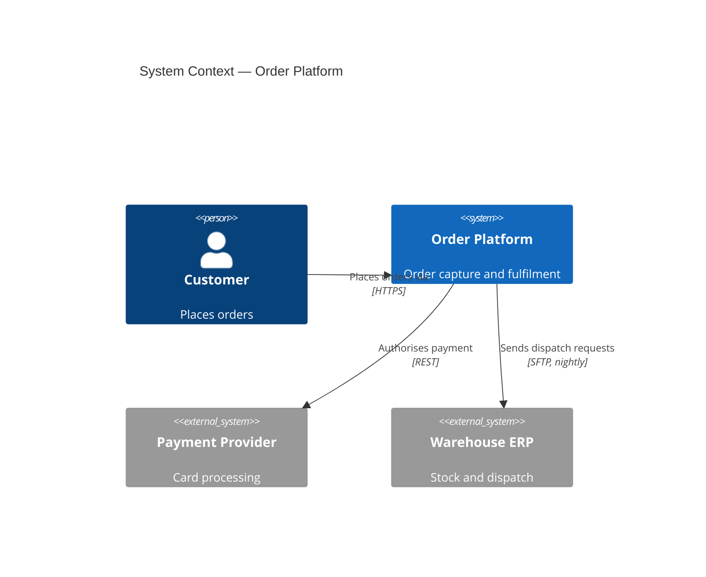

## The situation

There is a diagram in the wiki. It has fourteen boxes, no legend, arrows that
might mean data flow or dependency or deployment, and it was last edited two
years ago by someone who has left. Nobody trusts it, everybody references it,
and it is subtly wrong in ways that mislead new joiners for months.

## The default

**Use the C4 levels** — not as a formal methodology, but as a rule that each
diagram has exactly one level of abstraction and says which.

| Level | Shows | Audience | Update frequency |
|---|---|---|---|
| **1. Context** | Your system, its users, and external systems | Everyone, including non-technical | Rarely — this is the stable one |
| **2. Container** | Deployable units: apps, services, databases, queues | Engineers, ops | Per architectural change |
| **3. Component** | Modules inside one container | Team owning that container | Often — usually not worth drawing |
| **4. Code** | Classes, functions | Nobody; generate it if needed | Continuously |

The failure this prevents is the mixed-level diagram: a box called "Customer"
next to a box called "Redis" next to a box called "AuthMiddleware." Three levels
of abstraction in one picture, and no reader can tell what they are looking at.

**Draw levels 1 and 2. Rarely 3. Never 4 by hand.**

## What every diagram needs

- **A title stating what it shows and at what level.**
- **A legend**, if there is more than one kind of arrow or box.
- **A date and an owner.**
- **Consistent arrow semantics.** Pick one meaning — "depends on" or "sends data
  to" — and state it. Mixing them makes a diagram unreadable.
- **Fewer than about nine boxes.** Beyond that, split into multiple diagrams at
  the same level. A diagram nobody can hold in their head is decoration.

## Diagrams as code

Hand-drawn diagrams in a drawing tool are the reason diagrams go stale: they
live outside the repository, require a specific tool, and cannot be reviewed in
a PR.

Text-based diagrams (Mermaid, PlantUML, D2, Structurizr) fix most of that:

The benefits are practical: diffs are reviewable, the diagram sits next to the
code it describes, a stale diagram shows up in the same PR that made it stale,
and no proprietary tool is required.

The trade-off is layout control. Auto-layout will sometimes produce something
uglier than you would draw by hand. For anything but a presentation, accept it —
correctness beats aesthetics, and the aesthetics of a two-year-old wrong
diagram are worth nothing.

## Generate what you can

The highest-fidelity diagram is one derived from the system itself:

- **Service dependency graphs** from distributed tracing. This is real, current,
  and frequently reveals dependencies nobody knew existed.
- **Infrastructure diagrams** from Terraform state or cloud APIs.
- **Data flow** from schema and CDC configuration.

Generated diagrams cannot be wrong in the way hand-drawn ones are. They can be
overwhelming, so use them for verification — "does the drawn diagram match
reality?" — rather than as the primary explanation.

That gap, between what you drew and what tracing shows, is one of the most
informative artefacts a team can produce.

## When the default is wrong

Whiteboard sketches during a design conversation should be fast, messy, and
disposable. Do not apply any of this to thinking-in-progress; the ceremony kills
the exploration.

The rules apply to diagrams that get *saved* and referenced later. Everything
else should be photographed and thrown away.

## What it costs

Text-based diagramming has a learning curve and a syntax that will occasionally
fight you. Rendering needs to be wired into your docs pipeline.

And no tooling solves the underlying problem: a diagram is a model, and models
drift. The only real defence is putting the diagram where a change to the system
is likely to touch it — in the repository, in the PR, in the same review.

## See also

- [Architecture Decision Records](../adr/)
- [Building a Team Architecture Memory](../team-memory/)
