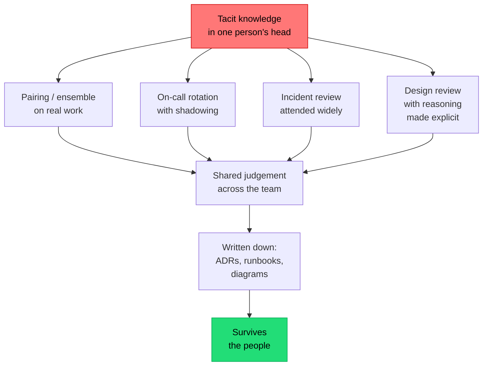

## The situation

A team has been running a system for four years. The three people who made the
foundational decisions have left. What remains is code, a wiki with a lot of
stale pages, and a set of behaviours nobody can explain — a retry count that is
oddly specific, a service that must be deployed before another, a table nobody
will touch.

The system still works. Nobody can safely change it. This is the end state of
purely tacit architecture knowledge, and it is extremely common.

## The default

**Four artefacts, each with a different job. None of them is "the wiki."**

| Artefact | Answers | Lifetime |
|---|---|---|
| [ADRs](../adr/) | Why is it like this? What did we reject? | Permanent, immutable |
| [Diagrams](../diagrams/) | What is it, at what level? | Updated with the system |
| [Runbooks](../runbooks/) | What do I do when it breaks? | Updated after every incident |
| [RFCs](../design-reviews/) | What are we about to do, and who disagreed? | Permanent, archived after decision |

Plus one thing that is not a document: **rotation**. Knowledge that only one
person has is not team knowledge, regardless of what is written down.

## Why wikis fail and what to do instead

The default corporate answer is a wiki, and wikis reliably decay. The
mechanisms are predictable:

- **No ownership.** A page belongs to everyone, so nobody updates it.
- **No expiry.** Wrong pages look exactly like right pages.
- **Distance from the code.** Nothing about changing the system prompts you to
  change the page.
- **Search that surfaces the 2019 version first.**

What works better:

- **Put documentation in the repository**, so it is reviewed in the same PR as
  the change and is found by people already in the code.
- **Give every document an owner and a review date** in its front matter, and
  flag stale ones automatically.
- **Prefer immutable records over living documents.** An ADR from 2023 marked
  "Accepted, superseded by ADR-31" is useful. A wiki page last edited in 2023
  that claims to be current is actively harmful.
- **Delete aggressively.** A smaller set of trusted documents beats a large set
  of uncertain ones.

That last point is the one teams resist. Wrong documentation is worse than
none: it costs the same time to read and produces false confidence.

## The practices that transmit tacit knowledge

Documents capture decisions. They do not transmit judgement. For that:

Note the direction: **practices first, documents second.** A team that writes
ADRs but never pairs and never rotates on-call has documentation without
judgement. A team that pairs and rotates but writes nothing has judgement that
evaporates with attrition.

Both halves are required, and the practices are the harder half because they
cost time continuously rather than in bursts.

## Concrete things that work

- **On-call rotation including the people who did not build it.** Nothing
  transfers operational knowledge faster, and nothing exposes bad documentation
  more reliably.
- **Incident reviews open to everyone**, published, with the timeline. The most
  effective architecture teaching material most organisations produce is their
  own postmortems.
- **A "how we got here" document per major system** — a narrative, not a
  specification. Two pages explaining the sequence of decisions and the
  conditions that drove them. New joiners consistently rate this the most
  useful thing they read.
- **Onboarding that assigns reading**: ADR index, last five postmortems, the
  context diagram. Then a real, small change in the first week.
- **Archaeology as a task.** When someone asks "why does this do that" and
  nobody knows, make finding out a ticket, and write the answer as an ADR
  marked retrospective.

## When the default is wrong

A short-lived system — a migration tool, a one-quarter experiment — does not
need this. Be explicit that it is disposable, and say so in the README, because
disposable systems have a habit of becoming permanent precisely because nobody
documented that they were meant to be thrown away.

## What it costs

All of it costs time that could be spent shipping, and the benefit arrives
later and is diffuse. That asymmetry is why teams under pressure stop, and why
the knowledge gap is usually discovered during the worst possible quarter.

The honest argument is not that documentation is virtuous. It is that the
alternative — a system nobody can safely change — has a cost that shows up as
slowing velocity, rising incident duration, and an inability to hire your way
out, because a new engineer takes nine months to become useful instead of six
weeks.

Write down the reasoning. It is the only part of the work that does not
compile.

## See also

- [Architecture Decision Records](../adr/)
- [The Internal Platform as a Product](/docs/platform/platform-as-product/)
