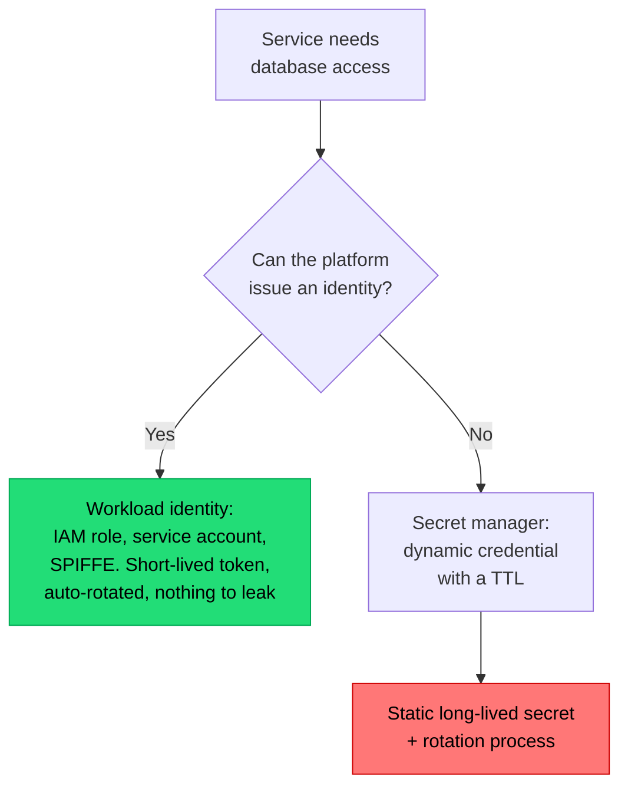

## The situation

The app needs a database URL, a feature flag, an API key, and a log level. Some
of these vary per environment, some are sensitive, some change at runtime, and
teams routinely handle all four with the same mechanism — usually environment
variables in a deploy script — and then wonder why rotating a key requires a
redeploy of nine services.

## The default

Separate config by **how it changes** and **who may read it**:

| Kind | Example | Where it lives | Change cadence |
|---|---|---|---|
| **Build-time constants** | Feature set, compile flags | In the artifact | Per build |
| **Environment config** | DB host, region, log level, service URLs | Deploy-time injection (env vars, ConfigMap) | Per deploy |
| **Runtime config** | Feature flags, rate limits, kill switches | A config service or flag system, read live | Seconds |
| **Secrets** | DB password, API keys, signing keys | A secret manager, fetched at start or refreshed | On rotation |

The distinction that matters most: **runtime config must not require a deploy**.
If turning off a misbehaving integration requires a build and a rollout, your
incident response time is bounded by your pipeline duration.

## Secrets: the rules that are not negotiable

- **Never in the repository.** Not encrypted-in-repo-with-a-key-in-CI either,
  unless the tooling (SOPS, sealed-secrets) is deliberate and reviewed. A secret
  in git history is compromised permanently.
- **Never in the container image.** Images get pushed to registries, shared, and
  scanned.
- **Never in a log line.** Structured logging with automatic redaction of known
  key names, plus a scan in CI for common patterns.
- **Never passed as a command-line argument.** Visible in `ps`.
- **Rotatable without a code change.** If rotation requires a PR, rotation will
  not happen.

Environment variables are acceptable for secrets in most contexts, with a
caveat: they are visible to the whole process, appear in crash dumps and some
error reporters, and are inherited by child processes. Files mounted with tight
permissions are marginally better. Neither is the real control — the real
control is short-lived credentials.

## Prefer identity over secrets

The strongest version of secret management is having fewer secrets.

Cloud workload identity (IAM roles for service accounts, managed identities)
removes the credential entirely — the platform attests to who the workload is
and issues a short-lived token. If your platform supports it, using anything
else for cloud service access is a choice to have a secret you did not need.

## Environments

The classic dev / staging / prod ladder has a known weakness: staging is never
actually like production, so it validates less than people believe.

Things that make staging worth having:
- Same artifact, same deploy mechanism, same infrastructure shape.
- Realistic data volume (synthetic or anonymised — never a raw production copy;
  that is a data breach with a friendly name).
- Real integrations, or high-fidelity fakes that are versioned alongside the
  contract.

Things that make it theatre:
- Different infrastructure, hand-configured.
- A tenth of the data.
- Everything mocked.
- Nobody notices when it is broken for a week.

If staging is theatre, be honest and invest in
[progressive delivery](/docs/delivery/progressive-delivery/) instead —
production with a 1% canary tells you more than a fake environment does.

## When the default is wrong

Very small teams can reasonably use a single secret manager entry per
environment and skip the taxonomy. The distinctions above earn their keep when
multiple services share secrets and multiple people need to rotate them.

## What it costs

Four mechanisms instead of one means four things to learn, document, and
operate. A runtime config service is a new dependency in your request path, and
if it is down, your defaults had better be sane.

Design the failure mode explicitly: **what does the service do if the flag
system is unreachable?** The answer should be "use the last known value, or a
safe compiled-in default" — never "fail to start."

## See also

- [Secrets and Key Management](/docs/security/secrets-management/)
- [Infrastructure as Code](../infrastructure-as-code/)
