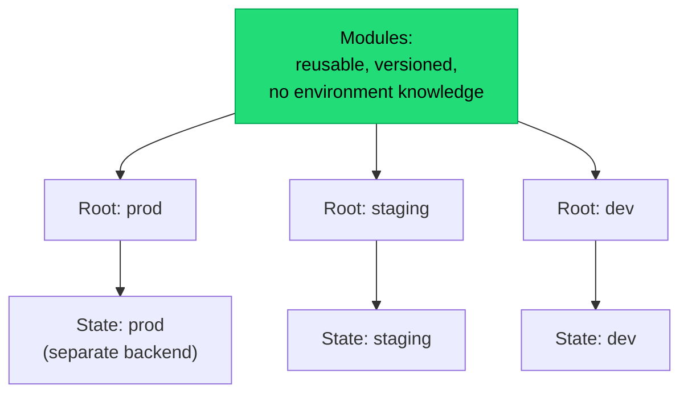

## The situation

Everything is in Terraform. Then someone fixes an urgent problem in the console
at 2am, and now the code and reality disagree. Six months later a routine
`apply` proposes to delete a security group that is holding production
together.

Drift is not a tooling failure. It is what happens when the code is not the
only way changes get made.

## The default

**The declared state is the only state, enforced by a mechanism, not a rule.**

| Practice | What it prevents |
|---|---|
| Humans have read-only access to production infrastructure by default | The 2am console fix, structurally |
| Break-glass access is time-limited, logged, and triggers a follow-up | Emergencies still being possible, without becoming normal |
| `plan` runs on every PR and posts the diff | Surprises at apply time |
| `plan` runs on a schedule against main, and alerts on non-empty output | Drift going unnoticed for months |
| Remote state with locking | Two applies racing and corrupting state |
| State file access is as restricted as production credentials | State files contain secrets |

The scheduled drift detection is the one people skip and the one that catches
the real problems. A daily "plan against main, alert if not empty" job is an
hour of setup and it turns a class of nasty surprise into a ticket.

## Structuring it so it stays maintainable

Rules that hold up over time:

- **Separate state per environment.** One state file for everything means a
  mistake in dev can propose changes to prod, and a corrupted state takes out
  all environments.
- **Also separate state by blast radius**, not just environment. Networking,
  data stores, and applications change at different rates and with different
  risk. A single 4000-resource state file takes 15 minutes to plan and nobody
  reads the output.
- **Modules contain no environment-specific values.** If a module has an `if
  environment == "prod"` branch, it is not a module, it is a fork with extra
  steps.
- **Version and pin module references.** Same reasoning as
  [dependency pinning](/docs/delivery/build-reproducibility/).
- **Do not use IaC to manage everything.** Application-level config, DNS records
  changed hourly, and anything with a faster change cadence than your PR cycle
  will fight the tool.

## The bootstrapping and destruction problems

Two things IaC handles badly, worth knowing in advance:

- **Bootstrap.** The state backend itself, the identity used to run the tool,
  and the account structure cannot be created by the tool that needs them.
  Accept a small, documented, manual bootstrap. Trying to eliminate it produces
  elaborate machinery for a one-time task.
- **Destruction.** `terraform destroy` on production is one command away from
  catastrophe. Use deletion protection on stateful resources, `prevent_destroy`
  lifecycle rules, and separate credentials that cannot delete data stores at
  all.

## Terraform vs the alternatives, briefly

Pulumi (real programming languages), CDK (same, cloud-specific), Crossplane
(Kubernetes-native), and cloud-native tools (CloudFormation, ARM) all solve the
same core problem with different trade-offs. The main axis:

- **Declarative DSL (Terraform, CloudFormation):** constrained, so the blast
  radius of a bad abstraction is limited. Verbose. Easy to read a diff.
- **General-purpose language (Pulumi, CDK):** powerful, testable, and capable of
  producing infrastructure code so abstract that nobody can predict what an
  apply will do.

The second category's failure mode is real. If you take it, keep the
abstraction shallow and always review the rendered plan, not the source.

## When the default is wrong

Small setups genuinely may not need IaC. A single VM running one application,
managed by a documented script, is honest and cheap. The point of IaC is
reproducibility and review — if there is nothing to reproduce and one person to
review, the ceremony can exceed the value.

The threshold is roughly: more than one environment, or more than one person
making changes.

## What it costs

IaC makes fast changes slower. A firewall rule that took 30 seconds in the
console now takes a PR, a review, a plan, and an apply. That friction is
mostly the point, but during an incident it is a genuine problem — which is why
the break-glass path must exist and be practised, not just documented.

## See also

- [Environments, Config, and Secrets](../environments-and-secrets/)
- [Kubernetes: What You Sign Up For](../kubernetes-reality/)
