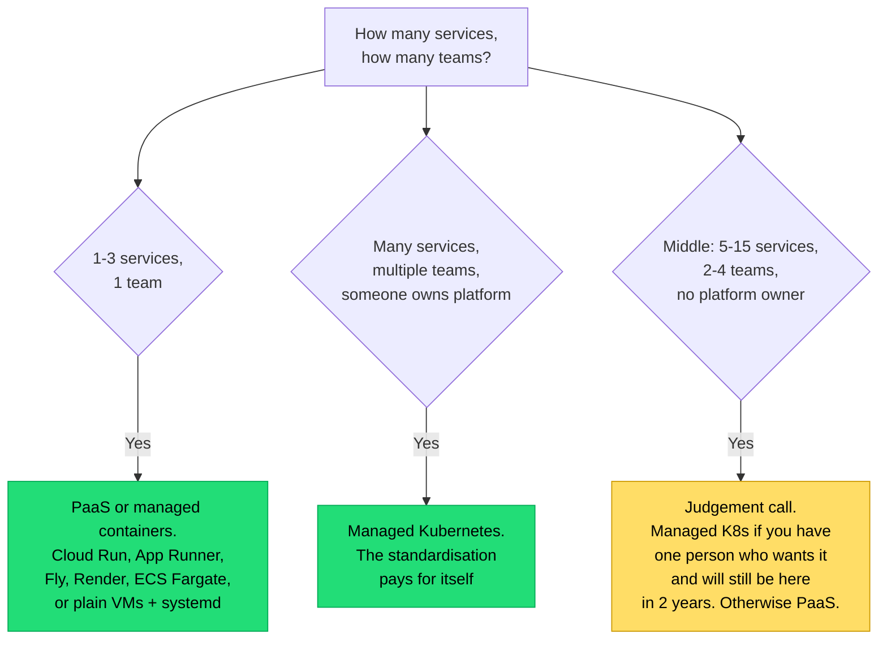

## The situation

The decision is usually framed as "should we use Kubernetes?" and answered with
either enthusiasm or cynicism. Neither is useful. The honest framing is: **what
problems does it solve, what does it charge, and are you big enough for the
trade to be positive?**

## What it actually gives you

- **A declarative API for infrastructure.** You describe desired state; a
  control loop reconciles. This is genuinely powerful and is the real product.
- **A standard vocabulary** across teams and clouds. Deployment, Service,
  Ingress, ConfigMap mean the same thing everywhere.
- **An extension point.** Operators and CRDs let you encode your own
  operational knowledge as automation. This is where large organisations get
  the most value.
- **Bin-packing and self-healing** for stateless workloads.

## What it charges

| Cost | Reality |
|---|---|
| **Conceptual surface** | Pods, Services, Ingress, RBAC, network policy, CNI, CSI, admission control, PDBs, HPAs, taints, affinities. Everyone on the team needs a working model of most of it |
| **Upgrade treadmill** | Roughly quarterly minor releases with ~14 months of support. API deprecations break manifests. This is permanent work |
| **Debugging depth** | A failing request can be application, sidecar, CNI, kube-proxy, DNS, ingress controller, or cloud LB. The failure surface is deep |
| **DNS and networking gotchas** | CoreDNS behaviour, `ndots:5`, conntrack limits, and MTU issues will each cost you a day at some point |
| **Resource management** | Requests and limits are a genuine skill. Set them wrong and you get either OOMKills or a cluster at 20% utilisation costing full price |
| **Security config** | Default settings are permissive. Pod security, network policy, and RBAC are all opt-in work |

The upgrade treadmill is the one that surprises people. It is not a one-time
adoption cost; it is a recurring tax, forever, and it needs an owner.

## The size question

The middle box is where most bad decisions happen — and the deciding variable
is people, not technology. Kubernetes without a named owner degrades into an
unpatched cluster that everyone is afraid to touch.

## If you do adopt it

- **Managed control plane**, always. EKS, GKE, AKS. Running etcd yourself is a
  specialist job with no upside for you.
- **Do not run your primary database on it** unless you have a strong reason
  and a mature operator. Managed RDS-equivalents exist for good reasons.
- **Set resource requests on everything.** Missing requests means the scheduler
  is guessing and your capacity planning is fiction.
- **PodDisruptionBudgets on anything with an SLO**, or a node drain during an
  upgrade takes you down.
- **Skip the service mesh initially.** It solves real problems (mTLS, traffic
  shifting, observability) at the cost of another control plane, another set of
  failure modes, and a sidecar in every pod. Add it when you have the specific
  problem, not as part of adoption.
- **One way to deploy.** Helm or Kustomize or plain manifests plus GitOps —
  pick one. Three ways to deploy is three ways to be confused during an
  incident.

## When the default is wrong

If you already have Kubernetes expertise on the team and everything else
already runs on it, adopting it for the next service is obviously right
regardless of that service's size. Consistency has value.

Conversely, teams sometimes adopt Kubernetes specifically for portability
between clouds. Be sceptical — your cloud dependencies are in the managed
database, the object store, the identity system, and the load balancer, not the
container runtime. Kubernetes portability is real but narrower than the pitch.

## What it costs

Roughly one engineer's ongoing attention per cluster environment at small
scale, more if you build platform capabilities on top. If you do not have that
person, you do not have Kubernetes — you have a cluster nobody upgrades.

## See also

- [Infrastructure as Code](../infrastructure-as-code/)
- [The Internal Platform as a Product](../platform-as-product/)
