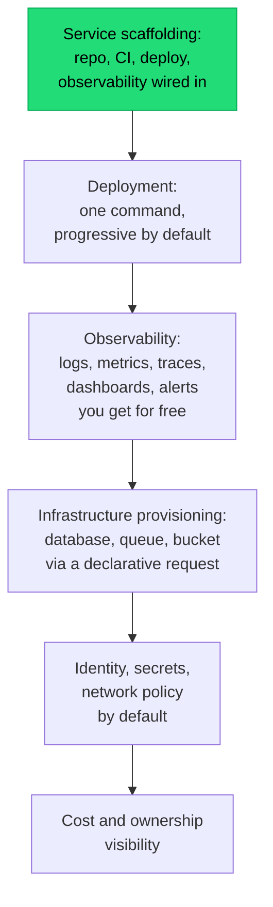

## The situation

An organisation grows past the point where every team can invent its own
deployment, monitoring, and infrastructure approach. Someone forms a platform
team. Six months later there is a platform, a mandate to use it, and a
significant number of teams quietly working around it.

The failure is almost never technical. It is that the platform was built as
infrastructure rather than as a product with users who have alternatives.

## The default

**Golden path, not golden cage.** Make the supported way clearly the easiest
way, and let teams leave it when they have a real reason — while making that
choice visible and costed.

| Product thinking | Infrastructure thinking |
|---|---|
| "What is our users' biggest friction?" | "What should teams be required to do?" |
| Adoption is voluntary and measured | Adoption is mandated and assumed |
| Documented, discoverable, self-service | Ticket-based, tribal knowledge |
| Backward compatible; migrations are supported | Breaking changes announced in a channel |
| Success = teams ship faster | Success = compliance percentage |

The measurable version: **how long does it take a new team to get a
hello-world service into production with monitoring, CI, TLS, and an on-call
rotation?** If the answer is more than a day, the platform is not done. If the
answer is "they file a ticket and wait," it is not a platform.

## What a platform should actually cover

Rank by "every team needs this and nobody wants to build it":

Start at the top. A scaffolding template that produces a working, observable,
deployable service is the highest-leverage thing a platform team can ship, and
it is achievable in weeks rather than quarters.

The trap is starting at the bottom — building an elaborate abstraction layer
over cloud resources before anyone has asked for it.

## Anti-patterns

- **The abstraction that leaks immediately.** A YAML dialect that wraps
  Kubernetes but exposes 80% of its concepts anyway. Teams now learn two things
  instead of one. If you cannot hide the complexity, do not add the layer.
- **The mandate without the migration.** "All teams must be on the platform by
  Q3" with no migration tooling and no support means teams spend Q3 not
  shipping product.
- **Platform as gatekeeper.** If the platform team must approve every change,
  they are a queue, and the organisation routes around queues.
- **No deprecation policy.** Platforms accumulate v1, v2, and v3 of everything
  because removing anything breaks someone. Publish support windows from the
  start.
- **Building for the platform team's taste.** The users are application
  developers with product deadlines, not infrastructure enthusiasts.

## Measuring it

Treat these as product metrics and report them:

- Time from empty repo to production for a new service.
- Fraction of services on the current supported version.
- Number of support requests per team per month (should trend down).
- DORA metrics for teams on the platform vs off it — if the platform is not
  improving them, it is not working.
- Voluntary adoption rate, when adoption is genuinely voluntary.

That last one is the honest signal. If teams choose the platform when they
could opt out, it is good. If adoption requires enforcement, something is
wrong, and it is worth finding out what before adding more enforcement.

## When the default is wrong

Below roughly 30–40 engineers, a dedicated platform team is usually premature.
The same effort spent on shared conventions, a good template repository, and
one person maintaining CI gets most of the value without creating an
organisational boundary.

Also, in strongly regulated environments some things genuinely must be
mandatory — audit logging, encryption, access control. Make *those* mandatory
and non-negotiable, and everything else a golden path. Mixing the two
categories is what makes platforms feel like bureaucracy.

## What it costs

A platform is a permanent commitment: support, on-call, upgrades, migrations,
documentation, and backward compatibility. It is a product with internal
customers who cannot easily switch vendors, which means their frustration
accumulates rather than showing up as churn.

Budget for the support load, not just the build. It is typically the larger
number after year one.

## See also

- [Kubernetes: What You Sign Up For](../kubernetes-reality/)
- [Building a Team Architecture Memory](/docs/knowledge/team-memory/)
