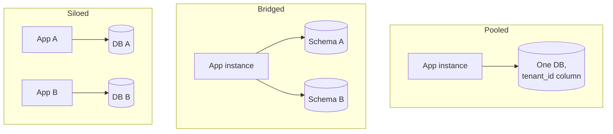

## The situation

You have customers. Their data has to be separated. How separate is a decision
that touches the data model, the deployment topology, the pricing, the
compliance story, and the on-call load — and it is close to impossible to
change later.

## The three models

| | Pooled | Bridged (schema/DB per tenant) | Siloed (stack per tenant) |
|---|---|---|---|
| Cost per tenant | Lowest | Medium | Highest |
| Blast radius | All tenants | All tenants (shared compute) | One tenant |
| Noisy neighbour | Real problem, needs quotas | Partially isolated | None |
| Per-tenant restore | Hard | Easy | Trivial |
| Onboarding a tenant | Insert a row | Run a migration | Provision a stack |
| Migrating 5000 tenants | One migration | 5000 migrations | 5000 deploys |
| Compliance story | "We isolate logically" | Better | "Your data is physically separate" |
| Deployment complexity | Low | Medium | High, needs real automation |

## The default

**Pooled**, with tenant isolation enforced at the lowest layer you can manage.

Reasons: it is the cheapest, it scales to many small customers, and the
operational model stays singular — one deploy, one migration, one dashboard.
Most SaaS businesses that succeed do so with a pooled core.

The critical requirement is that isolation cannot depend on every developer
remembering a `WHERE tenant_id = ?`. That is a bug waiting for a deadline. Push
it down:

- **Row-level security** in the database, with the tenant set per connection or
  transaction. The database refuses cross-tenant reads regardless of the query.
- Failing that, **a data access layer that no query bypasses**, plus a test that
  asserts cross-tenant access fails.
- **Tenant ID in every log line and trace**, so you can answer "was this
  customer affected" during an incident.

A single missing tenant filter in a reporting query is a data breach. Assume it
will happen and make the layer below refuse.

## When to silo

- **A customer contractually requires it**, and pays enough to cover a dedicated
  stack. This is normal in enterprise sales; price it explicitly.
- **Regulatory data residency** — the tenant's data must live in a specific
  jurisdiction. This can sometimes be handled by pooled-per-region rather than
  fully siloed.
- **A tenant is large enough to be a noisy neighbour on their own.** At that
  point they are effectively a separate deployment anyway.

The practical answer for most companies is **hybrid**: pooled by default, with
the ability to silo a named customer onto the same codebase and deployment
automation. Design for this early — the expensive version of siloing is the one
you retrofit.

## Cost boundaries

Whichever model you pick, you need to know **cost per tenant**, and it is
harder than it sounds in a pooled system.

- **Tag everything** that can be tagged with a cost dimension. Untagged
  resources become an unallocatable blob that grows.
- **Instrument per-tenant usage** of the expensive things: storage, compute
  seconds, egress, third-party API calls. Not for billing necessarily — for
  knowing which customers are unprofitable.
- **Set per-tenant quotas and rate limits from day one.** Retrofitting limits
  onto customers who have grown used to unlimited is a commercial conversation,
  not a technical one.
- **Watch the trend, not the total.** A 5% monthly growth in infra cost is
  invisible month to month and doubles in 14 months.

## When the default is wrong

Internal tools, single-customer systems, and products sold exclusively to large
enterprises with isolation requirements should not start pooled. Building
tenant machinery you never use is pure cost.

## What it costs

Pooled multi-tenancy means every incident is potentially every customer, and
every performance problem needs a tenant dimension to diagnose. It also means
you cannot easily give one customer a different version, which will come up in
enterprise sales.

Siloed means your deployment automation is now a product in its own right, and
"upgrade all tenants" is a rollout project rather than a deploy.

## See also

- [Least Privilege and Auditability](/docs/security/least-privilege/)
- [The Internal Platform as a Product](../platform-as-product/)
