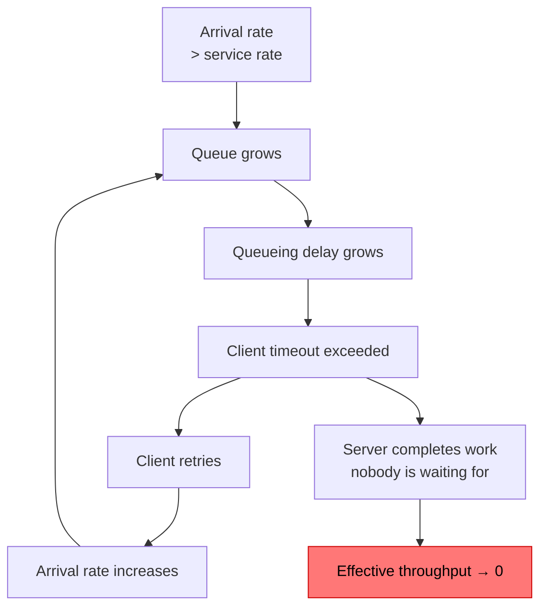

## The situation

Traffic doubles. The service slows. Queues grow. Timeouts fire. Clients retry,
which adds load. Latency rises further. Eventually everything times out and the
service is effectively down — and when traffic returns to normal, it *stays*
down, because the retry backlog keeps it saturated.

This is metastable failure. It is the most common way a healthy system dies,
and it is entirely preventable with limits.

## The default

**Every queue is bounded. Every request has a deadline. Every dependency has a
concurrency limit. Reject early rather than degrade for everyone.**

Concretely:

| Control | What it does |
|---|---|
| **Bounded queues** | An unbounded queue converts a throughput problem into a memory problem and then a crash. Bound it and reject when full |
| **Concurrency limits** | Cap in-flight requests per service and per dependency. Beyond the cap, shed |
| **Deadlines, propagated** | Every request carries remaining time. Work whose deadline has passed is abandoned, not completed |
| **Load shedding** | Reject excess requests fast (429/503 + `Retry-After`) rather than queueing them |
| **Rate limits per tenant** | One customer's spike must not consume everyone's capacity |
| **Circuit breakers** | Stop calling a failing dependency; fail fast and recover deliberately |

The counterintuitive one is load shedding. Rejecting 20% of requests instantly
so that 80% succeed normally is much better than serving 100% at ten seconds
each — because at ten seconds each, clients time out and retry, and you end up
serving 0%.

## Why unbounded queues fail

Note box G. Once queueing delay exceeds the client timeout, **every unit of
work the server completes is wasted** — the client already gave up. The server
is fully busy producing nothing. Deadline propagation fixes exactly this: check
the deadline before starting work, and drop what is already stale.

## Getting the numbers

Limits chosen by guessing are usually wrong by 10x in one direction. Two
approaches:

- **Load test to find the knee.** Ramp until latency degrades non-linearly. That
  point, minus headroom, is the concurrency limit. Do this on production-shaped
  infrastructure or the number is fiction.
- **Adaptive limits.** Algorithms like AIMD or Netflix's concurrency-limits
  adjust the cap based on observed latency, which handles the fact that
  capacity varies with request mix and instance size.

Adaptive is better if the tooling exists in your stack. A fixed limit derived
from a load test is a large improvement over no limit.

## Autoscaling is not a limit

Autoscaling is a capacity response, not an overload control, and it has three
gaps:

- **It is slow.** Instance start plus warm-up is typically 30 seconds to
  several minutes. Traffic spikes are faster.
- **It has a ceiling** — quota, cost, or a downstream dependency that does not
  scale. The database is usually the ceiling.
- **It can amplify failure.** Scaling up a service that is failing because it is
  overwhelming the database makes the database worse.

Have both: autoscaling for sustained load changes, shedding for spikes and for
protecting the components that cannot scale.

## When the default is wrong

Internal batch systems with no interactive users can happily use large queues
and long waits — nobody is timing out. The concern there is different: making
sure a backlog is visible and bounded by *time* rather than count.

Also, aggressive shedding on a low-traffic service can reject traffic that the
system could easily have handled, because the limit was set for a scale you
never reach. Limits should be well above normal peak, not near it.

## What it costs

Every limit is a number that can be wrong, and a wrong limit causes an outage
that looks exactly like the outage it was meant to prevent. Limits need to be
observable (how close are we?), adjustable at runtime without a deploy, and
alerted on when shedding begins.

They also change your API contract: clients must handle 429 and 503 correctly,
with backoff and jitter. A shedding server plus a naive client is worse than
neither.

## See also

- [Failure Modes](../failure-modes/)
- [Idempotency and Retries](/docs/system-design/idempotency-and-retries/)
