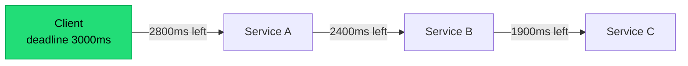

## The situation

Every distributed system needs to handle a dependency being slow, failing, or
gone. The patterns are well known. What is less well known is that the standard
configurations are usually wrong, and a misconfigured circuit breaker causes
outages that the unprotected system would not have had.

## Timeouts

**Every network call has a timeout. There are no exceptions.** A missing timeout
means a thread or connection held indefinitely, and enough of those means
resource exhaustion and a dead service.

The rules that are usually broken:

- **Set both connect and read timeouts.** Many clients default the read timeout
  to infinity. Check yours; do not assume.
- **Timeouts must decrease down the call chain.** If A times out at 3s and calls
  B with a 5s timeout, A abandons the request while B keeps working. B is now
  doing work for nobody, under load.
- **Propagate deadlines**, not durations. Pass "this request expires at T", so
  each hop knows the real remaining budget.
- **Derive the timeout from the SLO**, not from observed latency. "p99 is 400ms
  so timeout at 2s" is backwards — start from what the caller can afford to
  wait.

## Circuit breakers

A breaker stops calling a dependency that is failing, so you fail fast instead
of piling up timeouts.

Three states: **closed** (normal), **open** (reject immediately), **half-open**
(let a trickle through to test recovery).

Where it goes wrong:

- **Thresholds too sensitive.** Opening after 5 consecutive failures means a
  brief blip cuts off a healthy dependency, and now you have caused the outage.
  Use a failure *rate* over a window with a minimum request count.
- **No half-open state.** A breaker that opens and stays open until a human
  intervenes is a kill switch, not a breaker.
- **All-or-nothing recovery.** Half-open should let a small number through, not
  reopen the floodgates — otherwise recovery immediately re-triggers the
  failure.
- **Breakers on the wrong thing.** Breaking on a whole host when the problem is
  one endpoint, or vice versa. Scope the breaker to the failure domain.
- **No fallback.** A breaker converts a slow failure into a fast failure. If
  there is nothing sensible to return, you have improved latency during an
  outage and nothing else. That is sometimes enough — but decide deliberately.

**A breaker is only useful if there is something better to do than wait.** Cached
data, a degraded response, a default value, or a queued retry. If the answer is
"return an error either way," a timeout may be all you need.

## Bulkheads

Isolate resource pools so one failing dependency cannot consume all of them.

The canonical failure it prevents: service A calls dependencies B and C from a
shared thread pool. C becomes slow. All threads end up waiting on C. Calls to
B now fail too, despite B being perfectly healthy.

Separate pools — per dependency, per tenant class, or per criticality — contain
that. Practical forms:

- Separate connection pools and thread pools per downstream dependency.
- Separate worker pools for high-priority and bulk work.
- Separate instances entirely for the critical path vs everything else.

The cost is lower utilisation: reserved capacity sits idle. That is what
isolation buys, and it is generally worth it on the paths that matter.

## Getting the combination right

| Symptom | Reach for |
|---|---|
| Threads stuck on a slow dependency | Timeout + bulkhead |
| Repeated calls to a dead dependency wasting time | Circuit breaker |
| One tenant's traffic starving others | Bulkhead + rate limit |
| Retries amplifying an outage | Retry budget + jitter (see [Idempotency and Retries](/docs/system-design/idempotency-and-retries/)) |
| Queue growing without bound | Bounded queue + shedding (see [Capacity](../capacity-and-backpressure/)) |

## Testing it

These patterns are only correct if exercised. They fail silently when
misconfigured, and the discovery event is an outage.

- **Fault injection** in staging or a canary: inject latency and errors into a
  dependency and confirm the system degrades as designed.
- **Game days.** Turn a dependency off deliberately, during business hours,
  with everyone watching. Whatever surprises you is the finding.
- **Assert on the config in tests.** A unit test that asserts every HTTP client
  has a non-infinite timeout catches the most common regression.

## What it costs

Each pattern adds configuration, and configuration drifts from reality as
dependencies change. Three services with breakers and bulkheads have a
combinatorial set of behaviours under partial failure that nobody has fully
reasoned about.

The mitigation is not more patterns but fewer, well-understood ones, plus
regular exercise. A team that has never tested its breakers has decorative
resilience.

## See also

- [Capacity and Backpressure](../capacity-and-backpressure/)
- [Synchronous vs Asynchronous](/docs/system-design/sync-vs-async/)
