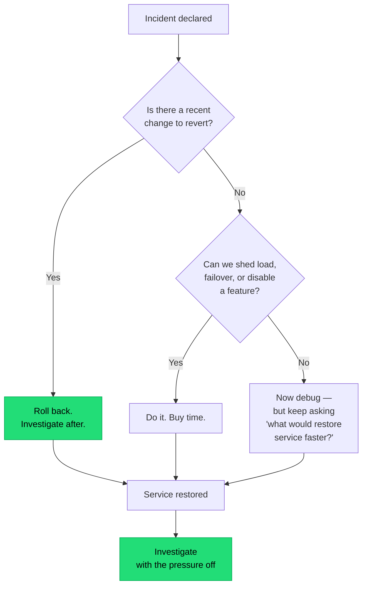

## The situation

Something is broken. Several people are in a channel. Someone is running
commands. Someone else is also running commands. Nobody is sure who is talking
to the customer, and the timeline is being reconstructed from memory
afterwards.

Incident response is a skill and a structure, and teams that have not
practised it improvise badly under stress.

## The default

**Declare early, assign roles, restore first, investigate second.**

Roles, even for a small incident (one person can hold two, but say which):

| Role | Does | Does not |
|---|---|---|
| **Incident commander** | Coordinates, decides, keeps the timeline | Debug hands-on |
| **Operations lead** | Makes the changes, one person touching production | Communicate externally |
| **Communications** | Updates status page, stakeholders, support | Debug |
| **Scribe** | Records actions and timestamps as they happen | Anything else |

The most valuable rule is the second column of the operations row: **one person
makes changes**. Two people independently restarting things is how a
recoverable incident becomes a confusing one.

## Restore before you understand

The instinct to find the root cause first is strong and usually wrong.
Diagnosis is slower under pressure, produces worse conclusions, and every
minute spent on it is a minute of user impact. Restore, then think.

Corollary: this only works if [rollback](/docs/delivery/rollback/) is fast and
practised. Incident response quality is largely determined before the incident.

## Declaring early

Teams under-declare because declaring feels like admitting something. The cost
asymmetry says otherwise: a declared incident that turns out to be minor costs
20 minutes of a few people's time. An undeclared incident that turns out to be
major costs an hour of uncoordinated flailing before anyone takes charge.

Make declaring cheap and normal. A single command that creates the channel,
pages the roles, and starts the timeline removes most of the hesitation.

## Blameless postmortems

"Blameless" is widely misunderstood as "do not mention who did what." It
actually means: **assume everyone acted reasonably given the information
available to them, and ask why the system made the wrong action reasonable.**

Names in a timeline are fine and often necessary. What is not fine is a
conclusion of the form "X should have been more careful."

| Instead of | Ask |
|---|---|
| "X ran the wrong command" | Why did the system accept a command that could do this? Why was there no confirmation, dry run, or limited-blast-radius default? |
| "The runbook was not followed" | Why was the runbook wrong, out of date, or hard to find at 3am? |
| "We should be more careful" | What check, guardrail, or automation would make care unnecessary? |
| "Human error" | Human error is a starting point, never a conclusion |

The practical test: **would the same failure happen with a different person in
the chair?** If yes — and it almost always is yes — the finding is about the
system.

## What makes a postmortem useful

- **Written within a few days**, while memory is fresh.
- **A precise timeline** with timestamps, including detection time and
  mitigation time. Time-to-detect is often the biggest improvable number.
- **Contributing factors, plural.** Single root causes are usually a
  simplification; real incidents have several conditions that had to align.
- **Action items with owners and dates**, tracked in the normal backlog. A
  postmortem whose actions are never done is a writing exercise.
- **Published widely.** The value compounds when other teams read it — most
  organisations have the same failure several times in different services.

Ruthlessly limit action items. Five items, of which two get done, is worse than
two items that both get done. Prioritise the ones that reduce time-to-detect
and time-to-restore over the ones that prevent this exact cause — the exact
cause rarely recurs, but slow detection recurs constantly.

## When the default is wrong

Not every problem is an incident. A single failed batch job with a retry, a
known flaky test, or a minor degradation with no user impact should be a ticket.
Declaring incidents for everything trains people to ignore the declaration.

Also, genuinely malicious action — a deliberate breach, not a mistake — is a
security event with a different process, and "blameless" does not apply in the
same way.

## What it costs

Incident process is overhead during the calmest 99% of the time, and its value
appears only in the worst 1%. That makes it easy to let decay: roles nobody
remembers, a runbook nobody has read, a status page nobody has permission to
update.

The counter is practice. Game days and deliberate failure injection keep the
process alive, and they surface the gaps while it is safe to find them.

## See also

- [Rollback Is a Feature](/docs/delivery/rollback/)
- [Runbooks and On-Call Docs](/docs/knowledge/runbooks/)
