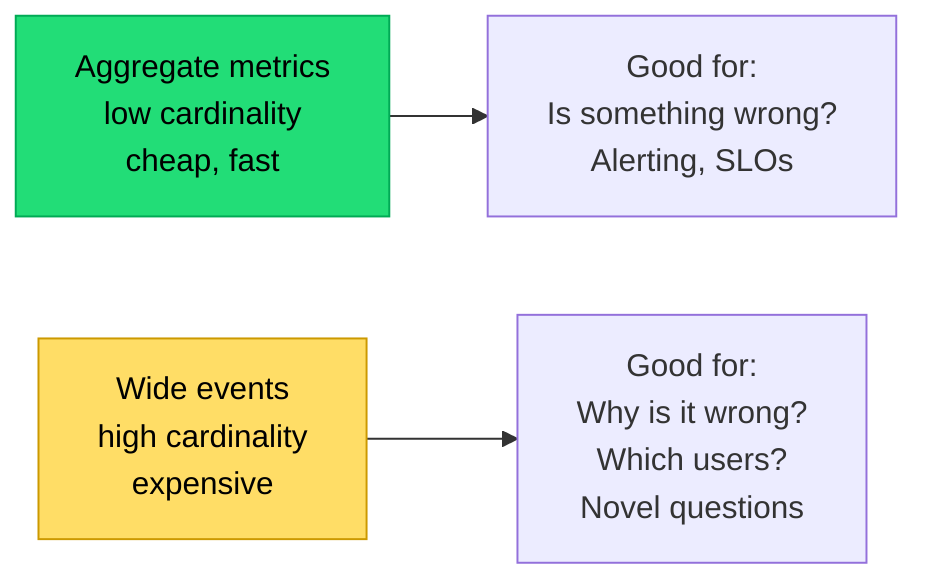

## The situation

You have logs, metrics, and traces, a five-figure monthly bill for them, and
during the last incident nobody could work out why checkout was failing for one
customer segment.

Volume is not observability. The test is whether you can answer a *new*
question about production without shipping code.

## The default

Wire these four things, in this order. Each is cheap and each unlocks a class
of question.

**1. Structured logs with a request ID.**
JSON, one event per line, with a trace/request ID propagated through every
service. Not free text. The moment logs are structured, "show me every log line
for this failing request across all services" becomes a query instead of an
archaeology project.

Include on every line: timestamp, level, service, version, trace ID, tenant ID,
user ID (if any), and the operation. Those seven fields answer most incident
questions.

**2. The four golden signals per service.**

| Signal | Metric | Catches |
|---|---|---|
| Latency | p50, p95, p99 — *separated by success and failure* | Slow responses; fast failures hiding in the average |
| Traffic | Requests per second | Load changes, traffic loss |
| Errors | Rate by type and endpoint | The obvious |
| Saturation | CPU, memory, connections, queue depth, thread pool | Impending failure before it happens |

Latency of failed requests must be tracked separately. A service that fails
instantly looks fast, and averaged p99 latency will improve during an outage —
which has misled more than one on-call engineer.

**3. Distributed tracing on the critical paths.**
Not everything, initially. Trace the request flows that matter — checkout,
login, the main API — and sample. Tracing is what answers "where did the 900ms
go," which is unanswerable from logs and metrics alone in a multi-service
system.

**4. A small number of business metrics.**
Orders per minute. Signups per hour. Messages delivered. These catch the class
of failure where every technical metric is green and the product is broken —
a bad deploy that returns 200 with an empty response body, for example.

Business metrics are the most valuable and the most often missing.

## The high-cardinality point

The reason "observability" is distinguished from "monitoring" is
**cardinality**. A metric aggregated across all users cannot answer "why is it
broken for this one customer." An event with tenant ID, user ID, version,
region, and feature flag state can.

You need both. Use metrics for detection and alerting, wide events or traces
for diagnosis. Trying to use metrics for diagnosis leads to a dashboard sprawl
of pre-computed breakdowns that never quite match the question you have.

## Controlling cost

Observability bills grow superlinearly with service count and can quietly
exceed the infrastructure they observe.

- **Sample traces**, aggressively, but keep 100% of errors and slow requests.
  Tail-based sampling if your tooling supports it.
- **Log levels that mean something.** Debug logs in production at full volume
  are almost always waste. Make level adjustable at runtime for a specific
  service or tenant.
- **Short hot retention, long cold.** Full-fidelity for 7–14 days, aggregated
  or archived after.
- **Delete unused dashboards and alerts** on a schedule. They cost query load
  and, worse, attention.
- **Cardinality limits.** One badly-labelled metric with a user ID as a label
  can multiply your metrics bill overnight. Guard against it in review.

## When the default is wrong

A single-service application does not need distributed tracing; it needs good
logs and a profiler. Do not buy the full stack before you have the problem it
solves.

At the other extreme, some domains need more: regulated systems need immutable
audit trails distinct from operational logs, and real-time systems need
continuous profiling.

## What it costs

Instrumentation is code that must be maintained, and it spreads through every
handler. Use OpenTelemetry or an equivalent so the instrumentation is not
vendor-specific — the tooling market changes and re-instrumenting is expensive.

The subtler cost: comprehensive observability lets you tolerate more complexity,
which encourages more complexity. Teams sometimes use good tooling to manage a
system that should have been simplified instead.

## See also

- [SLOs and Error Budgets](../slos-and-error-budgets/)
- [Incident Response](../incident-response/)
