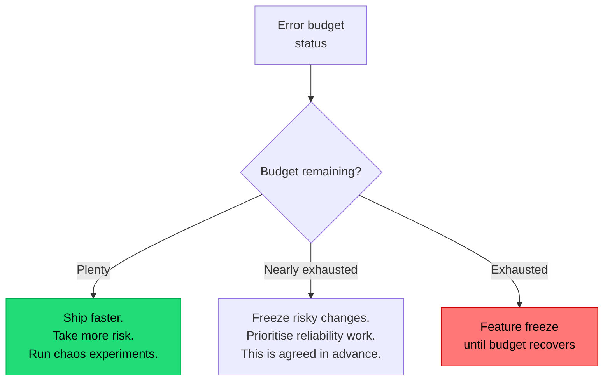

## The situation

Leadership wants "five nines." Engineering wants time to pay down debt. Product
wants features. Everyone is arguing from intuition, and the loudest voice
wins.

An SLO converts that argument into arithmetic. That is its real function —
reliability improvement is a side effect.

## The default

**One or two SLOs per user-facing service, measured from the user's
perspective, with an error budget that has an agreed consequence.**

Three components, all required:

- **SLI** — the measurement. "Proportion of HTTP requests to `/checkout`
  returning non-5xx within 500ms."
- **SLO** — the target. "99.5% over a rolling 28 days."
- **Error budget** — the permitted failure. 99.5% over 28 days = about 3.4
  hours of budget.

The budget is the useful part. It reframes reliability from "never fail" to
"you have 3.4 hours of failure to spend this month, spend it deliberately."

## Choosing the number

Do not start from "how reliable should we be." Start from **what users notice
and what the business loses**.

| Target | Downtime / 28 days | Typically appropriate for |
|---|---|---|
| 99% | ~6.7 hours | Internal tools, batch systems |
| 99.5% | ~3.4 hours | Most internal-facing services |
| 99.9% | ~40 minutes | Standard customer-facing services |
| 99.95% | ~20 minutes | Revenue-critical paths |
| 99.99% | ~4 minutes | Requires multi-region, automated failover, mature ops |
| 99.999% | ~25 seconds | Almost certainly not you |

Two things to internalise:

1. **Each nine costs roughly an order of magnitude more.** Going from 99.9% to
   99.99% is not 10% more work; it typically means redundancy across failure
   domains, automated failover, and eliminating all manual steps from recovery.
2. **Your ceiling is your dependencies.** If you synchronously depend on a
   provider at 99.9%, you cannot promise 99.95%. Add up the chain before you
   commit.

Set the target slightly *below* current performance if users are happy. An SLO
that you already meet comfortably still does its job: it tells you when you
have started degrading, and it gives you budget to spend on velocity.

## Using the budget

The consequence must be agreed **before** the budget is exhausted, with the
people who will resist it. An error budget policy that nobody signed is a
dashboard, not a policy — and the first time it triggers, it will be overruled.

The upside direction matters too and gets forgotten: a large remaining budget
is permission to move faster. If you are consistently at 99.99% against a 99.9%
target, you are over-investing in reliability and should spend some of that on
velocity.

## Alerting on budget burn

Alerting on "error rate > 1%" produces pages for brief blips that nobody needed
to wake up for. Alert on **burn rate** instead — how fast you are consuming the
budget relative to the window.

A common configuration: page when the burn rate implies the whole budget will
be gone in a few hours; open a ticket when it implies exhaustion within days.
This dramatically reduces noise while catching both fast outages and slow
degradation.

## When the default is wrong

- **Pre-launch or very early products.** You have no users, no traffic, and no
  data. Skip formal SLOs; watch errors and move on.
- **Batch and async systems.** Availability is the wrong SLI. Use freshness
  ("95% of records processed within 10 minutes of arrival") or completeness.
- **Systems where a single failure is catastrophic** — safety-critical control
  systems. Statistical budgets do not model "the one that matters."

## What it costs

SLOs require honest measurement, which means instrumenting from the user's
side, not the server's. Server-side success rates miss the requests that never
arrived — DNS failures, load balancer errors, client timeouts — which are
exactly the outages users complain loudest about.

They also require organisational buy-in that survives the first inconvenient
trigger. A team that declares an SLO and then overrides the policy under
pressure has spent credibility for nothing. Fewer SLOs, honestly enforced, beat
a comprehensive set that everyone ignores.

## See also

- [Observability](../observability/)
- [Incident Response](../incident-response/)
