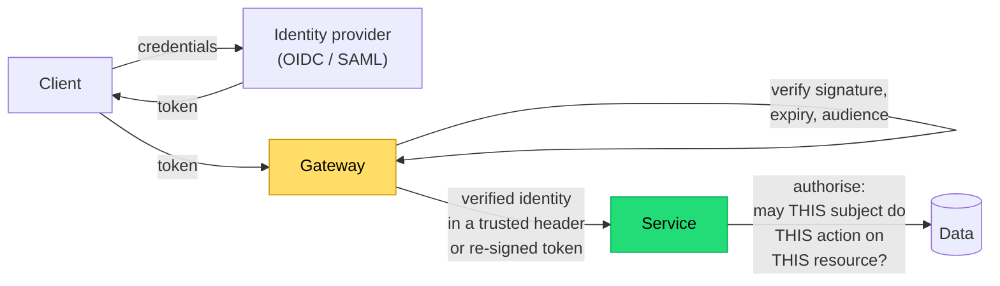

## The situation

Authentication is a solved problem you should not be solving — use an identity
provider. Authorisation is not solved, is specific to your domain, and is where
the real bugs live: the endpoint that checks you are logged in but not that the
resource is yours.

## The default

**Authenticate at the edge. Authorise at the resource. Never trust the client
about identity.**

The gateway proves *who*. Only the service knows *whether* — because
authorisation depends on the resource, and only the service sees the resource.

A gateway that authorises by URL pattern (`/admin/*` requires the admin role)
handles coarse cases and misses the entire class of "user A requesting user B's
object," which is the most commonly exploited authorisation flaw in web
applications.

## Rules that prevent the common failures

- **Authorise on the object, not the route.** `GET /orders/123` must check that
  order 123 belongs to the caller. Every time. No exceptions for internal
  endpoints.
- **Deny by default.** A new endpoint with no authorisation annotation should
  fail closed. Make this structural — a framework default or a test that
  enumerates routes and asserts each has a policy.
- **Never take identity from a client-supplied parameter.** `?userId=` is a
  vulnerability with a query string.
- **Do not use guessable identifiers as the only protection.** Sequential IDs
  plus a missing check is trivially enumerable. UUIDs help but are not
  authorisation.
- **Re-check on every request.** Authorisation decided at login and cached in a
  session does not reflect a revoked permission.
- **Validate the token properly**: signature, issuer, audience, expiry, and
  algorithm. Accepting `alg: none` or failing to check audience are classic
  bugs, and they exist because someone wrote the verification by hand. Use the
  library.

## Choosing an authorisation model

| Model | Fits | Breaks down when |
|---|---|---|
| **RBAC** — roles carry permissions | Most internal apps, clear job functions | Permissions depend on the resource ("owner of this document") — you get role explosion |
| **ReBAC** — permissions from relationships | Sharing, hierarchies, collaboration (Google Docs shape) | Needs a real system (Zanzibar-style); overkill for simple cases |
| **ABAC** — policy over attributes | Complex conditional rules, compliance constraints | Policies become hard to reason about and test |

Start with RBAC plus explicit ownership checks. That covers most applications.
Move to ReBAC when you find yourself creating roles like
`editor_of_project_42`, which is the signal that relationships, not roles, are
your real model.

Whichever you pick, **centralise the decision logic**. Authorisation scattered
across controllers cannot be audited or tested comprehensively. One module, one
set of tests that enumerate subject × action × resource cases.

## Service-to-service identity

Internal calls need identity too. The network is not a security boundary — an
attacker inside the perimeter, or a compromised dependency, gets to call
anything reachable.

- **mTLS or signed tokens** between services, with the workload identity issued
  by the platform (see
  [Environments and Secrets](/docs/platform/environments-and-secrets/)).
- **Propagate the end user's identity**, distinctly from the calling service's
  identity. Service B needs to know both "service A called me" and "on behalf of
  user U." Collapsing these means B cannot enforce user-level authorisation.
- **Do not use a shared static API key** for internal calls. It cannot be
  rotated without coordination, cannot be scoped, and appears in logs.

## When the default is wrong

A single-user internal tool behind a VPN with no sensitive data can reasonably
have minimal authorisation. Be honest that this is what you have chosen, and
note it — these systems have a habit of growing users and data without anyone
revisiting the assumption.

## What it costs

Proper authorisation makes every feature slightly more work: each new endpoint
needs a policy, each new resource type needs ownership semantics, and the test
matrix grows.

The counter is that centralising it makes the cost sublinear. The teams for
whom authorisation is expensive are usually the ones who spread it across
hundreds of hand-written checks.

## See also

- [Threat Modeling](../threat-modeling/)
- [Least Privilege and Auditability](../least-privilege/)
