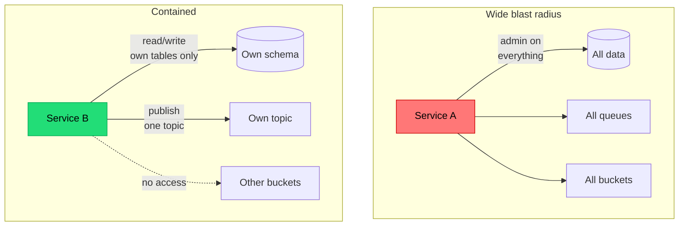

## The situation

Assume a component is compromised — a leaked credential, a malicious
dependency, a vulnerable endpoint. The question that determines whether this is
an incident or a catastrophe is: **what can it reach?**

That answer was determined by permission decisions made long before, usually
under time pressure, usually by granting more than necessary because narrowing
it was fiddly.

## The default

**Start from zero and add what is needed, with expiry.** The opposite —
starting broad and narrowing later — never happens, because narrowing risks
breaking something and nobody is rewarded for it.

Practical rules:

| Rule | Why |
|---|---|
| Each service has its own identity, not a shared one | Shared identity means you cannot tell who did what, and revoking affects everyone |
| Permissions scoped to specific resources, not `*` | `s3:*` on all buckets is the difference between one bucket leaked and all of them |
| Read and write separated | Most services need read on most things and write on few |
| Human production access is time-limited and requested | Standing admin access is a permanent liability that gets phished |
| Break-glass exists, is logged, and triggers a review | Emergency access must be possible or people build shadow paths |
| Permissions expire | An access grant with no end date is permanent by default |

The expiry rule is the most effective and least implemented. Access granted for
a migration in March is still there in December, on an account that has since
changed teams.

## Blast radius as a design property

Architectural choices that reduce blast radius, roughly in order of leverage:

- **Separate accounts or projects per environment.** A compromise in staging
  should not reach production. This is the single highest-value boundary and it
  is free at the cloud level.
- **Network segmentation with default-deny.** Services can reach what they need
  and nothing else. Default-allow inside a VPC means one foothold reaches
  everything.
- **Data-level isolation** — row-level security, per-tenant encryption keys —
  so that even a compromised application cannot read everything.
- **Separate credentials for read and for destructive operations.** The service
  that reads user records does not need `DELETE`.

## Auditability

Least privilege limits damage. Audit logs let you determine what happened,
which is required for incident response, for regulatory notification, and for
knowing whether you actually need to notify.

What must be recorded, immutably:

- Authentication events, including failures.
- Authorisation denials — a spike in denials is a strong intrusion signal, and
  it is usually not collected.
- Access to sensitive data: who, what record, when, from where.
- Privileged operations: permission changes, config changes, data exports,
  break-glass usage.
- Changes to the audit configuration itself.

Properties that matter:

- **Separate from application logs**, with different retention and access.
  Operational logs get rotated and are writable by the application; audit logs
  must not be.
- **Append-only, and outside the compromised component's reach.** An audit log
  the application can delete is not evidence.
- **Actually reviewed.** Alert on the patterns that matter — privilege
  escalation, bulk export, access outside normal hours or geography. An
  unreviewed audit log is storage cost until an incident makes it archaeology.

## When the default is wrong

Least privilege taken to an extreme creates a permission system so granular
that developers cannot get work done and route around it — a shared admin
account "just for debugging" defeats the entire scheme.

Calibrate: tight around data and production, looser in development environments
that contain no real data. The failure mode of excessive strictness is shadow
access, which is worse than a slightly broad grant you can see.

## What it costs

Fine-grained permissions are ongoing work: every new feature may need a new
grant, and debugging "why can't this service do X" becomes a routine task.
Invest in making permission requests fast and self-service, or the friction
will produce workarounds.

Audit logging costs storage — potentially a lot, for high-traffic data access —
and needs a retention policy driven by regulation rather than by convenience.

## See also

- [Identity and Authorisation](../identity-and-authorization/)
- [Multi-Tenancy and Cost Boundaries](/docs/platform/tenancy-and-cost/)
