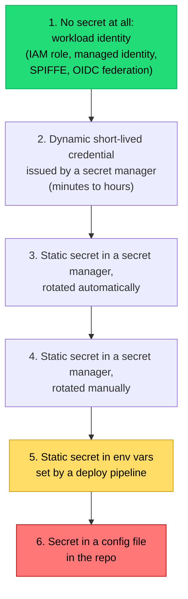

## The situation

A database password, an API key for a payment provider, a signing key for
tokens, an SSH key for a legacy box. Each has a different lifetime, blast
radius, and rotation story, and most teams handle all of them with the same
mechanism and the same (never) rotation cadence.

## The default

A ladder, best to worst. Move each secret as far up as your platform allows.

Rung 1 is available more often than teams realise. Cloud access, CI to cloud
(OIDC federation instead of long-lived keys), Kubernetes to cloud, and
service-to-service auth can usually all be done with attested identity and no
stored credential.

Every rung you climb removes a thing that can leak.

## Rotation is the real test

A secret you cannot rotate in under an hour is a secret you will not rotate
when it matters — and "when it matters" means after a suspected compromise,
under pressure.

Design for rotation from the start:

- **Support two valid credentials simultaneously.** Rotation is expand/contract:
  add the new one, deploy consumers to accept both, switch producers, remove
  the old. A design that allows only one valid key at a time forces a
  synchronised cutover, which means downtime, which means it never happens.
- **No deploy required.** If rotating requires a rebuild, rotation is coupled to
  your release process. Read secrets at startup with a refresh, or on each use
  from a cached client.
- **Rehearse it.** Rotate a production secret deliberately, on a normal
  Tuesday. Whatever breaks is what would have broken during the incident.

## Keys are not passwords

Cryptographic keys need more than storage:

- **Use a KMS or HSM** for keys that sign or encrypt at rest. The key never
  leaves; you send data to be signed. A key material blob in a secret manager
  is a key you can leak.
- **Separate keys by purpose.** One key for signing tokens, another for
  encrypting data, another per environment. A single key everywhere means one
  compromise is total.
- **Version keys and support decryption with old versions** while encrypting
  with the new one. Without this, key rotation requires re-encrypting all data
  atomically, which is not possible at scale.
- **Never roll your own crypto**, including protocol construction. Use the
  library's high-level interface.

## Detection

Assume a secret will leak eventually and instrument for it:

- **Secret scanning in CI and on push**, blocking. Plus scanning of git history
  once, to find what is already there.
- **Provider-side leak detection** — GitHub and the major cloud providers scan
  public repos and will notify you. Enable it.
- **Alert on anomalous credential use**: a key used from a new region, at an
  unusual rate, or after hours.

If a secret reaches a repository, **it is compromised**, even in a private repo,
even after a force-push. Rotate it. Removing it from history is cleanup, not
remediation.

## When the default is wrong

Local development should not require the full apparatus. Developers need to run
the system, and making that painful pushes people toward copying production
credentials to their laptop — which is far worse than a checked-in dummy secret
for a local container.

Provide obviously-fake local defaults, and make production access require
deliberate, audited action.

## What it costs

A secret manager is another dependency in your startup path. If it is
unavailable, services cannot start — which is correct behaviour, but means its
availability must exceed that of everything depending on it. Cache fetched
secrets in memory with a refresh, so a transient outage does not cascade.

Short-lived credentials also complicate debugging: the credential that worked
five minutes ago does not now, and that confuses people until they learn the
model.

## See also

- [Environments, Config, and Secrets](/docs/platform/environments-and-secrets/)
- [Supply Chain Integrity](../supply-chain/)
