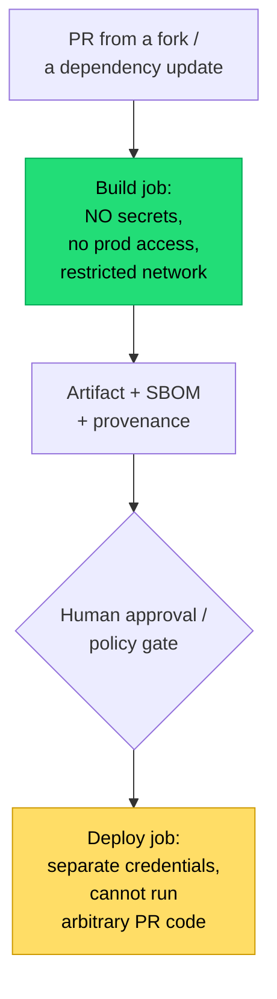

## The situation

A typical application has a handful of direct dependencies and several hundred
transitive ones. Any of them can execute code at install time, at build time,
and at runtime. Your CI has credentials. This is a supply chain, and it is
attacked because it works.

## The default

Three layers, in order of value per effort:

**1. Know what you have.**
- Lockfiles committed, exact versions, digest-pinned base images.
- Generate an SBOM at build time and store it with the artifact. When the next
  widely-exploited library vulnerability is announced, the question "are we
  affected, and where" should take minutes, not days.
- An inventory of which services use which dependency, queryable.

**2. Reduce what you have.**
- Every dependency is a permanent liability with an ongoing patch cost. A
  seventeen-line utility package is not worth a supply chain entry.
- Prefer the standard library. Prefer fewer, larger, well-maintained
  dependencies over many small ones.
- Review new dependencies at least as carefully as new code: maintenance
  activity, number of maintainers, transitive footprint, install scripts.

**3. Control what it can do.**
- Disable install scripts where the ecosystem allows (`npm ci --ignore-scripts`
  plus an allowlist).
- Build in a network-restricted environment with dependencies from an internal
  proxy or mirror.
- Least privilege in CI: build jobs get no production credentials; deploy jobs
  are separate, and triggered by a promotion event rather than by arbitrary
  code in a PR.

That last one matters more than most controls. **A malicious dependency's
primary target is your build environment**, because that is where the
credentials are.

## The CI trust boundary

The common vulnerability: a single pipeline where a PR can modify the workflow
file and access deployment credentials. Anyone who can open a PR then has your
production keys. Separating build from deploy, and restricting which triggers
have access to secrets, closes it.

## Signing and provenance

Once artifacts are built, sign them and record where they came from:

- **Sign artifacts** (Sigstore/cosign for containers) so the deployment target
  can verify origin.
- **Generate provenance** (SLSA attestation): which source commit, which
  builder, which inputs.
- **Verify at admission.** Signing without verification is a ritual. The cluster
  or deployment system must reject unsigned or unattested images — otherwise
  the signature protects nothing.

Start with signing and verification of your own images. Third-party base image
verification is valuable but harder and can wait.

## Dependency updates

The tension: pinned dependencies do not update themselves, and unpatched known
vulnerabilities are the most commonly exploited path of all.

- **Automated update PRs** (Renovate, Dependabot) with grouping so the volume is
  manageable.
- **Auto-merge patch updates** when the test suite is trustworthy. If it is not,
  fix that first — it is blocking your security posture.
- **A cooling-off period** for new versions (Renovate's `minimumReleaseAge`)
  reduces exposure to compromised releases, which are usually caught within
  days.
- **Alert on severity, act on reachability.** Most reported vulnerabilities are
  not exploitable in your usage. Tools that do reachability analysis prevent
  alert fatigue, which is what actually causes teams to stop looking.

## When the default is wrong

An internal tool with no sensitive access does not need SLSA provenance and
admission verification. The effort should scale with what an attacker would
gain.

Conversely, if you *distribute* software — libraries, agents, on-premise
products — you are part of someone else's supply chain, and the bar is
substantially higher than anything described here.

## What it costs

Supply chain controls add friction to the most routine action a developer
takes: adding a library. Done badly, it becomes a review queue that people
route around by vendoring code or copy-pasting.

Make the safe path fast: a pre-approved internal registry, automated
scanning that gives an answer in seconds, and a lightweight exception process
for the rest.

## See also

- [Build Reproducibility](/docs/delivery/build-reproducibility/)
- [Secrets and Key Management](../secrets-management/)
