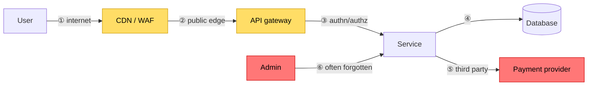

## The situation

Threat modelling has a reputation for being a heavyweight process with
specialist tooling that happens once, produces a document, and is never read
again. That reputation is earned, and it is why most teams do not do it.

The lightweight version takes an hour, catches most of what matters, and can be
repeated whenever the design changes.

## The default

Four questions, in order, with the people who actually built the thing:

1. **What are we building?** Draw the data flow. Boxes for components, arrows
   for data, and — critically — **trust boundaries**: where data crosses from
   something you control to something you do not.
2. **What can go wrong?** Walk each trust boundary. Use STRIDE as a prompt list,
   not a methodology.
3. **What are we going to do about it?** For each realistic threat: mitigate,
   accept, transfer, or eliminate. Write down which.
4. **Did we do a good job?** Revisit when the design changes.

The trust boundaries are where the value is. Threats cluster at boundaries, and
teams that draw them usually find one they had not consciously noticed — an
internal service that is reachable from the internet, an admin interface with
no authentication because "it is internal," a queue that anyone in the VPC can
publish to.

## STRIDE as a prompt list

| | Threat | Ask at each boundary |
|---|---|---|
| **S** | Spoofing | Can someone claim to be another user or service? How is identity proven? |
| **T** | Tampering | Can data be modified in transit or at rest? |
| **R** | Repudiation | Can someone deny doing something? Is there an audit trail? |
| **I** | Information disclosure | What leaks — in responses, errors, logs, timing, or metadata? |
| **D** | Denial of service | What is expensive and unauthenticated? |
| **E** | Elevation of privilege | Can a user reach data or actions belonging to another? |

Elevation of privilege in multi-tenant systems is the highest-value box on this
table. See [Multi-Tenancy](/docs/platform/tenancy-and-cost/) — a missing tenant
filter is the most common severe finding in SaaS applications.

## The diagram

Numbered arrows crossing a trust boundary are where you spend the hour.
Boundary ⑥ — the admin path — is the one most often left out of the diagram and
most often missing controls.

## Prioritising what you find

You will generate more threats than you can address. Rank by:

- **Likelihood × impact**, roughly, not precisely.
- **Whether it is reachable without authentication.** Unauthenticated attack
  surface is categorically more urgent.
- **Whether a single mitigation covers many threats.** Mandatory authentication
  at a gateway, or row-level security in the database, closes whole classes at
  once. Prefer these over point fixes.

Then record the accepted risks explicitly. "We accept that an authenticated
user can enumerate order IDs, because they contain no sensitive data" is a
legitimate decision and belongs in writing — see [ADRs](/docs/knowledge/adr/).
An unrecorded acceptance is indistinguishable from an oversight during the next
audit.

## When to do it

- When a new service is designed, before it is built.
- When a trust boundary changes: a new integration, a new user type, exposing
  something previously internal.
- When handling a new class of data.
- After any security incident, on the affected area.

Not: annually as a compliance exercise, disconnected from actual design work.

## When the default is wrong

Systems with genuine adversaries and high stakes — payment infrastructure,
identity providers, critical infrastructure — need more than an hour and more
than a whiteboard. Formal analysis, external review, and penetration testing
are appropriate there.

The one-hour version is the *minimum viable habit*, chosen because a habit that
happens beats a methodology that does not.

## What it costs

An hour per significant design change, plus the discomfort of writing down
risks you are choosing not to fix. That written acceptance is uncomfortable
precisely because it creates accountability, which is also why it is valuable.

The failure mode: threat models that become a compliance artifact, produced to
satisfy a checklist and never revisited. If nobody has changed a design because
of a threat model, the practice is not working.

## See also

- [Identity and Authorisation Boundaries](../identity-and-authorization/)
- [Least Privilege and Auditability](../least-privilege/)
