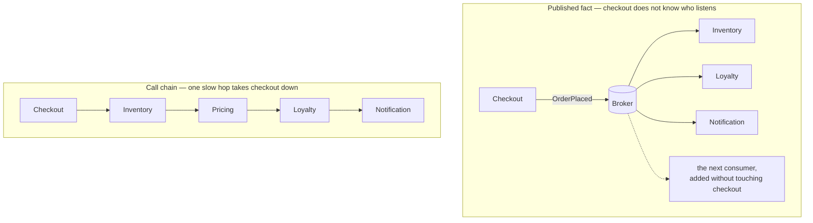
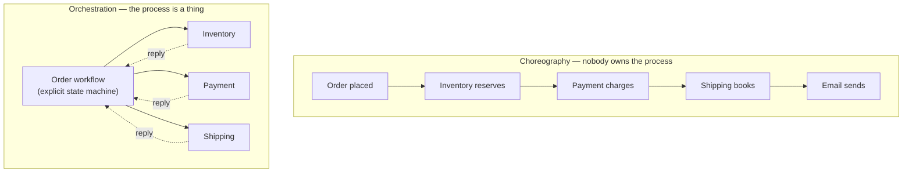
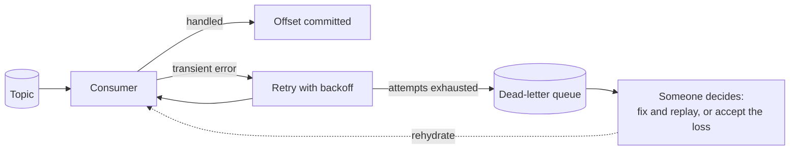

## The situation

Checkout calls inventory, which calls pricing, which calls loyalty, which calls
the notification service. One of them is slow this afternoon, so checkout is
down. Adding a service to this flow means editing checkout, and checkout is now
edited by four teams.

The event-driven style inverts that. Services publish **facts** about what
happened; anyone who cares subscribes. Checkout no longer knows who is
listening, and adding a consumer requires no change to the producer.

Whether a *given* call should be async is [Synchronous vs Asynchronous
Integration](/docs/system-design/sync-vs-async/). This page is about what
changes when the broker stops being an implementation detail and becomes the
backbone everything hangs off.

## Choreography and orchestration

This is the decision the style actually turns on, and most teams make it by
accident.

**Choreography** is wonderful to write and terrible to read. Each service is
simple in isolation. But no artefact anywhere answers "what happens when an
order is placed" — the process exists only as an emergent property of eleven
subscriptions, and the only way to learn it is to read all eleven. Then someone
adds a twelfth, and a cycle appears that nobody designed.

**Orchestration** puts the process in one place: a workflow, a saga
coordinator, a state machine. It is more code and it looks less elegant. It is
also the only version you can debug, monitor, resume, and explain to the
business.

The practical split, and it is not a compromise:

- **Choreography for reactions.** Notifications, analytics, search indexing,
  cache invalidation, audit. Things where nobody is waiting for an outcome and
  a missed consumer is a bug, not a business incident.
- **Orchestration for business processes.** Anything with money, compensation,
  a deadline, or a customer-visible status. If someone will one day ask "why is
  order 4471 stuck", you need a component whose job is to know.

## The non-negotiables

These are not maturity-model aspirations. Skipping them does not slow you
down later, it produces a specific outage.

- **Event contracts, versioned and enforced.** An event is a public API with
  one crucial difference: you cannot see who consumes it and you cannot make
  them upgrade. Schema registry, compatibility checks in CI, additive changes
  only.
- **Consumers are idempotent.** At-least-once delivery is what you have,
  whatever the broker's marketing says. Every consumer will see duplicates. See
  [Idempotency and Retries](/docs/system-design/idempotency-and-retries/).
- **Ordering assumptions written down.** Ordering is per-partition, and your
  partition key decides which events are ordered relative to each other. Teams
  discover this during an incident when two updates to the same entity land out
  of order.
- **A dead-letter queue plus a rehydration path, built before launch.** The
  question "a consumer was broken for six hours, now what" has exactly two
  answers: replay, or data loss. Decide which one you have before you need it.
- **Events carry a correlation ID, and tracing follows it.** Without this, a
  failure in an async chain is archaeology.

One more, easy to miss: **publish facts, not commands dressed as facts.**
`OrderPlaced` is a fact. `SendConfirmationEmail` on a topic is a command with
extra latency, and it recreates the coupling you paid to remove — now with no
error path back to the caller.

The dead-letter bullet is a path rather than a checkbox, and it is the path
nobody draws until the incident:

## When the default is wrong

- **Strong global invariants.** "Never sell the last item twice" does not
  survive eventual consistency. You need a synchronous check against a single
  authority, or an explicit reservation with a timeout. Overselling is a
  business decision, not an architectural side effect to discover in
  production.
- **The user is waiting for the outcome.** Async plus a spinner is worse than
  synchronous. If the answer must arrive in this HTTP response, make the call.
- **Small systems.** Three services and one team do not need a broker. They
  need function calls.
- **No operational maturity for async.** If the team has no tracing and no
  queue dashboards, an event-driven system is opaque by construction. Failures
  become silent rather than loud, which is worse.

## What it costs

**Eventual consistency reaches the UI, and then the business.** "Why does the
dashboard say 47 when the export says 46" becomes a recurring support ticket.
The right answer is to make lag visible in the product rather than pretend it
does not exist — but that is design work, and someone must do it.

**Debugging becomes reconstruction.** There is no stack trace across a broker.
The replacement is disciplined correlation IDs and tracing, which is a real
investment, not a tool you install.

**Schema evolution is forever.** You cannot deprecate an event on your own
schedule, because you do not control the consumers and may not know them all.
Every field you publish is a commitment of indefinite length.

**The broker becomes a single point of coupling and failure.** You removed
point-to-point coupling and centralised it. Broker downtime, partition
imbalance, retention misconfiguration and consumer lag are now first-class
operational concerns, and the team that owns them owns everyone's uptime.

**Cycles are invisible until they are an incident.** In a call graph a cycle
is a compile error or an obvious deadlock. In a subscription graph it is an
infinite loop that only manifests under a particular sequence, six months in.

## See also

- [Synchronous vs Asynchronous Integration](/docs/system-design/sync-vs-async/)
- [Idempotency and Retries](/docs/system-design/idempotency-and-retries/)
- [Event Sourcing and CDC: When It Pays](/docs/data-and-state/events-and-cdc/)
- [Capacity, Load Shedding, and Backpressure](/docs/reliability/capacity-and-backpressure/)
