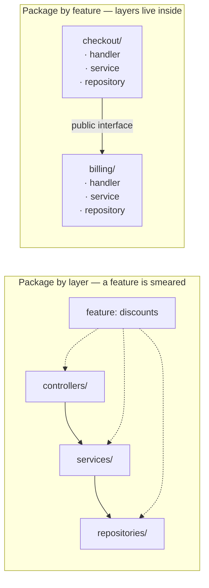

## The situation

You open an unfamiliar backend repository. There is a `controllers/` folder, a
`services/` folder, and a `repositories/` or `dao/` folder. You already know
roughly how it works, and so does every engineer you will ever hire.

Nobody decided this. It is what the framework tutorial did, and it propagated
because it is genuinely good at the thing it is good at. It deserves to be
named and defended rather than sneered at, because the alternative most teams
reach for is worse: the same layers, plus ceremony.

## The style

Horizontal layers, dependencies pointing one way — down. Each layer talks only
to the layer below it.

| Layer | Owns | Must not |
|---|---|---|
| Delivery (controller, handler, consumer) | Protocol, serialisation, auth check, mapping to a call | Contain business rules |
| Application / service | The use case, the transaction boundary, orchestration | Know about HTTP |
| Persistence (repository, DAO) | Storage access, queries, mapping rows | Decide anything |

The single technical rule is **no upward dependencies and no layer skipping**.
Everything else people write about N-tier is elaboration.

## Why it survives

- **Zero onboarding cost.** A new hire finds where to add code in ten minutes,
  without reading a design document that does not exist.
- **Frameworks are built for it.** Rails, Spring, Django, Laravel, NestJS all
  assume it. Fighting your framework is a permanent tax.
- **It matches the work.** Most enterprise software really is: validate input,
  run a rule or two, write a row, return a response. Modelling that as a rich
  domain is inventing a problem.

## The rot, and the two rules that prevent it

Layered systems fail in a specific, predictable way, and it is worth naming
because the failure looks like success until it doesn't.

Layers are a *technical* grouping. Features are not technical. So one change —
"add a discount code to checkout" — touches the controller, the service, the
repository, and the schema, in four different directories, none of which are
about checkout. Over a few years the `services/` folder becomes a drawer of
1,200-line classes named after nouns, business logic migrates into controllers
because that was closer, and some of it ends up in SQL because that was faster.

**Rule one: package by feature, layer inside it.** Layers describe dependency
direction. They are a terrible top-level directory structure and an excellent
rule *within* a module. This one change buys most of the benefit people go
looking for in fancier styles.

**Rule two: the application layer owns the transaction.** Not the controller,
not the repository. When the transaction boundary drifts upward you get HTTP
concerns tangled with commit semantics; when it drifts downward you get
partial writes nobody can reason about.

Two smaller ones worth enforcing in review: a repository returns domain types,
not ORM entities that lazily hit the database three layers up; and an anaemic
domain model is fine — until a single rule appears in three services, at which
point it belongs in a type, not a fourth copy.

## When the default is wrong

- **The domain has real rules.** Pricing, entitlements, regulated
  calculations, anything where "what is the correct answer" is genuinely hard.
  Business logic that can only be tested through a controller and a database is
  business logic nobody will refactor. Move to
  [Ports and Adapters](../ports-and-adapters/).
- **More than one delivery mechanism.** The moment the same use case is invoked
  by HTTP, a queue consumer, a cron job, and a CLI, the delivery layer stops
  being one layer and the dependency direction starts paying for itself.
- **Reads and writes want different shapes.** A layered stack has one model,
  and a reporting screen with twelve joins will eventually deform it. See
  [CQRS and Read Models](../cqrs-and-read-models/).

## What it costs

**Change amplification.** Every feature crosses every layer. This is
tolerable and it is also the reason velocity decays: the cost of a change
scales with the number of layers it must pass through, and layers only ever get
added.

**The schema becomes the domain model.** With no insulating type, the database
tables *are* the design. That is the single most expensive thing to change in
any system, and the layered style quietly makes it your architecture.

**"Service" stops meaning anything.** It is the default name for code with no
other home, so the layer with the most business value ends up with the least
structure.

Accept these knowingly on a CRUD-shaped system and you have made a good trade.
Accept them by default on a system with a real domain and you will pay for it
for years.

## See also

- [Monolith First, Split on Evidence](/docs/system-design/monolith-first/)
- [Coupling and Cohesion in Practice](/docs/foundations/coupling-and-cohesion/)
- [The Boring Baseline](/docs/foundations/boring-baseline/)
- [Ports and Adapters (Hexagonal)](../ports-and-adapters/)
