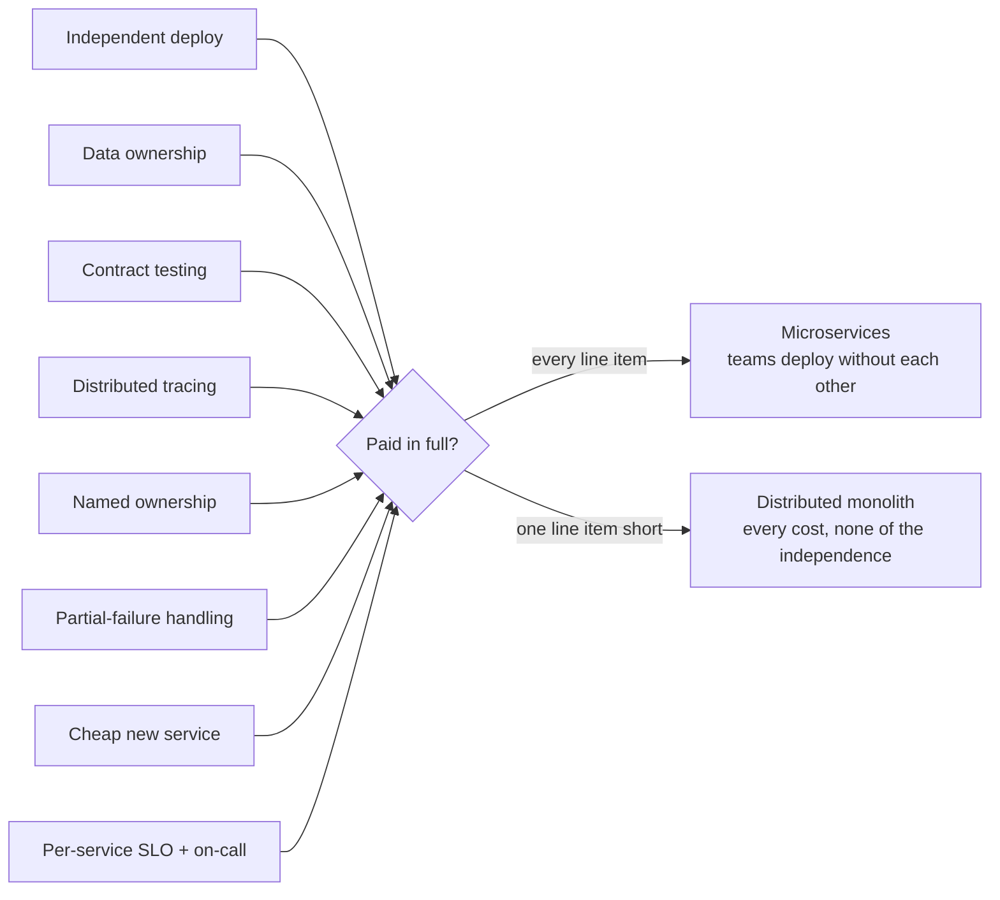

## The situation

The decision has been made — by you, by a predecessor, or by a slide deck from
2018. What matters now is that microservices are not a topology, they are a
*package deal*. The independent-deployment benefit is real, and it is
unlocked only by a set of capabilities that are individually boring and
collectively expensive.

Pay part of the bill and you do not get a partial benefit. You get a
**distributed monolith**: every cost of distribution, none of the independence.
This page is the itemised bill.

Whether to split at all is [Monolith First, Split on
Evidence](/docs/system-design/monolith-first/); where to draw the lines is
[Service Boundaries That Survive
Reorgs](/docs/system-design/service-boundaries/).

## The bill

| Line item | Why it is not optional | You skipped it if… |
|---|---|---|
| **Independent deploy per service** | The entire benefit. If services ship together, you have a monolith with network latency | A release is a coordinated event with a spreadsheet |
| **Data ownership — no shared database** | Two services writing one table are one service with extra steps | "Just add a column, both services read it" |
| **Contract testing** | Integration tests across N services do not scale; you need to break contracts at build time | You find breakages in staging, or in production |
| **Distributed tracing with propagated IDs** | A request crosses six processes; logs alone cannot reconstruct it | Debugging means opening six dashboards and comparing timestamps |
| **Per-service ownership, registered and enforced** | An unowned service is where security patches go to die | Nobody can name the owner of two of your services |
| **Timeouts, retries with backoff, idempotency, circuit breakers** | Partial failure is the steady state, not the exception | A downstream slowdown becomes a full outage |
| **A platform that makes a new service cheap** | If standing one up takes two weeks, teams will not split — they will bloat | New services get built inside existing repos to avoid the paperwork |
| **Per-service SLOs and on-call** | Aggregate uptime is meaningless when failure is partial | One dashboard, one number, one very tired team |

Read that table as a readiness checklist before splitting, and as a diagnosis
afterwards. Every unchecked row names a specific, recurring production
symptom.

The bill is not itemised so you can pick line items. It is itemised so you can
see which one you skipped.

## The arithmetic nobody runs beforehand

**Availability multiplies.** A request that synchronously touches six services
at 99.9% each has a ceiling of about 99.4% — roughly four hours of monthly
failure introduced by topology alone. The fix is not "make each service more
reliable"; it is to stop making the chain synchronous. See
[Synchronous vs Asynchronous
Integration](/docs/system-design/sync-vs-async/).

**Latency adds, and tails dominate.** Six hops at a 10ms median look fine and
then a p99 of 200ms somewhere in the middle becomes your p50 under load,
because tail latency compounds along a chain in a way medians do not predict.

**Coordination cost is why you did this.** The benefit is measured in
*deploys not blocked on another team*, not in tidiness. If you cannot show that
number improving, the split is not working, whatever the diagram looks like.

## When the style is right

- **Teams are blocking each other on deploys**, repeatedly and measurably. This
  is the dominant legitimate reason and it is an organisational one.
- **A component has genuinely different requirements** — 10× the traffic, a GPU,
  a different compliance regime, a runtime the rest of the stack cannot host.
- **Failure isolation is a stated requirement** and you have demonstrated the
  monolith cannot provide it.

## When the default is wrong

- **Fewer teams than services.** More services than teams guarantees orphans.
  This is the most reliable predictor of a bad microservices estate.
- **No platform team, and no budget for one.** The per-service infrastructure
  cost is paid N times by people who wanted to write features.
- **The boundaries are not stable.** Splitting is hard to reverse; merging is
  easy. Under domain uncertainty, coarse modules inside one deployable let you
  be wrong cheaply.
- **A distributed transaction sits at the centre of the domain.** If the core
  operation must be atomic across the proposed boundary, the boundary is wrong.
  Sagas and compensation are a real answer, but they are a business-visible
  answer — someone has to define what "refund the partially-completed order"
  means, and that someone is not an engineer.

## What it costs

**Every local refactor becomes a migration.** Renaming a field used to be an
IDE action. Now it is: add the new field, deploy, migrate consumers one by one,
wait for the slowest team, remove the old field, deploy again. Multiply by
every change that crosses a boundary. This single cost accounts for most of the
velocity loss teams report after splitting.

**Cognitive load per engineer goes up, permanently.** Not just "more repos" —
more pipelines, more dashboards, more runbooks, more versions of the shared
library in flight simultaneously.

**Infrastructure and spend multiply.** Sidecars, per-service databases, load
balancers, log volume from cross-service chatter. The cost line grows with
service count, not with traffic.

**Organisational change becomes architectural change.** Boundaries aligned to
teams decay when teams reorganise, and services do not move as easily as people
do. Expect a re-alignment project roughly as often as you expect a reorg.

**You cannot undo it quickly.** The reversibility asymmetry is the whole reason
to be conservative: merging two services is a week, splitting one is a quarter.
Err toward fewer, larger services at every decision point.

## See also

- [Monolith First, Split on Evidence](/docs/system-design/monolith-first/)
- [Service Boundaries That Survive Reorgs](/docs/system-design/service-boundaries/)
- [Failure Modes: Timeouts, Breakers, Bulkheads](/docs/reliability/failure-modes/)
- [The Internal Platform as a Product](/docs/platform/platform-as-product/)
