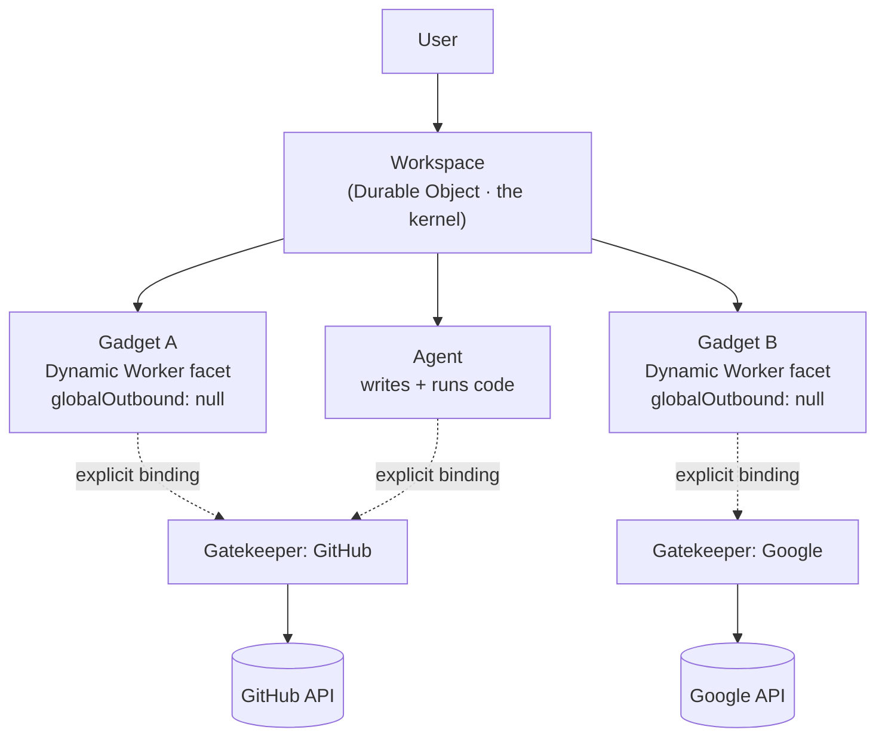

## The situation

You are building software that an AI agent will write and modify on behalf of
non-technical users. The usual answer is a multi-tenant service: one codebase,
one deployment, every user's data in the same database, isolation enforced by
`WHERE tenant_id = ?` and a code review culture.

That answer breaks under two new pressures. First, if users can change the
code, a shared deployment means one user's change is everyone's change.
Second, if an agent holds your credentials, a prompt injection in a fetched
document is a request executed with your authority.

[Cloudflare OS](https://github.com/cloudflare/cloudflare-os) — open sourced by
the Workers team in August 2026 — answers both by inverting the deployment
model. It is worth reading as a *style*, not as a product.

## The style in one paragraph

Every user gets a private instance of every app, running in a sandbox with no
network access and no ambient credentials. The instance is created from a
shareable code template, not from a shared server. Anything the instance needs
from the outside world — GitHub, Slack, Google, email — arrives as an
explicitly granted capability object brokered by a small per-service Worker,
which logs every call and holds side effects for human approval.

In the repo's own terms: the backend is a **kernel**, per-service brokers are
**drivers** (*Gatekeepers*), app instances are **processes** (*Gadgets*), and
the code templates they start from are **executables** (*Blueprints*).

The dotted edges are the whole design. They do not exist until a human creates
them, and nothing reaches the solid boxes on the right without one.

## The four mechanisms

**1. Per-user instances instead of a shared service.** A slide deck is not a
call into a slide-deck SaaS; it is a private instance of slide-deck code,
running in its own Cloudflare Workers *Dynamic Worker* facet inside the user's
workspace Durable Object. A cross-tenant data leak is not mitigated, it is
unrepresentable — there is no shared process holding two users' data. The cost
of an instance has to be near zero for this to be sane, which is exactly what
the isolate model provides and a container model does not.

**2. Deny-by-default sandboxing, enforced by the runtime.** The gadget server
is loaded with `globalOutbound: null` — it has no route to the internet at all,
only the bindings it was handed. The gadget client runs in an iframe with
`sandbox="allow-scripts"` (no `allow-same-origin`, so an opaque origin) and a
CSP of `default-src 'none'; connect-src 'none'`, talking to its own server
solely over a Cap'n Web RPC session tunnelled through `postMessage`. Untrusted,
AI-written code is safe to run because the sandbox is a platform primitive
rather than a lint rule.

**3. Capabilities, not configuration.** Most agent harnesses configure MCP
servers upfront, which makes every service ambiently available in every chat.
Here an agent or gadget starts with access to nothing, and a human
*introduces* it to a specific resource — pasting a repo URL, picking a
document. That mints a capability scoped to that resource. The repo enforces
this the way capability systems have to be enforced: a single chokepoint
(`getGatekeeperClassFor()` in `workshop-backend/src/user.ts`) is the only place
a gatekeeper capability is minted, and the review guidelines say to reject any
new path that goes around it. A gatekeeper is also forbidden from declaring
itself ambient; only user or admin configuration can do that.

**4. Asynchronous human-in-the-loop.** The interesting one. Synchronous
approval prompts fail in practice: the agent blocks on step one, the human
comes back from coffee to no progress, and the human eventually starts
auto-approving everything. Cloudflare OS lets the gatekeeper *simulate* an
unapproved side effect — reporting success and serving reads back as if it had
been applied — so the agent keeps working and queues dependent actions, while
the human approves or rejects the batch later. Note the honest limit: the
kernel requires that side effects not be applied before approval, but
simulation itself is a recommendation to gatekeeper authors, not something the
kernel can enforce. A gatekeeper that simulates badly produces an agent
reasoning about a world that never happened.

## The sharing invariant

The hard part of per-user instances is sharing, and the repo's answer is the
sharpest idea in it. The invariant: *if a gadget can read restricted
information, anyone who cannot read that information cannot interact with the
gadget.*

Enforcing it needs a fact the kernel does not have — whether Bob is allowed to
read Alice's repo. So the check runs where the knowledge lives. Bob supplies
his own connected account, the gatekeeper verifies Bob could directly read
everything the gadget has historically read through it, and only then is Bob
registered as an *observer*. Afterwards, any new read that a registered
observer could not make themselves is blocked outright.

This is the general lesson, independent of Cloudflare: **an authorisation
question belongs in the trust domain that owns the answer**, and access
granted by sharing must be checked against what has already been read, not
just what will be read next.

## When this style is right

- **The code is written by AI and modified by end users.** Per-user instances
  turn "the user broke the app" into a blast radius of one, and remove the
  feature-request queue entirely — the user changes their own copy.
- **The security team is the actual blocker.** Deny-by-default plus a complete
  action log plus deferred approval is a story that survives a security review
  in a way "we prompt the model to be careful" does not.
- **Your platform makes an instance nearly free.** Isolates and Durable
  Objects make per-user deployment cheap. This style on VMs, containers, or
  even per-tenant databases is a cost structure, not an architecture.

## When the default is wrong

The style assumes software is *personal*. It fits documents, dashboards,
internal tools, personal automation — things where one person's version being
different from another's is fine or desirable.

It is wrong wherever the shared instance *is* the product:

- **Network effects and shared state.** A marketplace, a ledger, a social
  graph. Per-user copies of a shared truth is just a distributed consistency
  problem you invented on purpose.
- **Compliance requiring uniform behaviour.** If every user runs a slightly
  different fork, "which version computed this number" has no answer. Regulated
  calculations want one audited implementation.
- **Central operability.** You cannot fix a bug for everyone by deploying.
  There are now N variants, most of them AI-written, and no rollout mechanism
  reaches them.
- **Anything where correctness beats autonomy.** Blueprints give users
  freedom to change the code. That is the feature, and it is also the reason
  you should not build the billing system this way.

Note also that these mechanisms are separable. Capability-scoped brokers with
deferred approval are worth stealing on their own, in front of a perfectly
ordinary multi-tenant service, and that is the cheapest way to adopt anything
from this style.

## What it costs

**Versioning becomes a distribution problem.** Blueprints are copies. Improve a
blueprint and existing gadgets do not change — you have shipped desktop
software, with the upgrade problem desktop software has, minus an installer.

**The kernel becomes a bottleneck by design.** The repo holds
`workshop-backend` to a deliberately higher bar: every line reviewed, large
changes split into separate PRs. That is the correct response to a component
whose bugs are cross-user compromises, and it means kernel work is slow work.
Any capability system pays this. Budget for it instead of discovering it.

**Debugging is per-instance.** "Reproduce it on staging" assumes a shared
deployment. Here the failing artefact is one user's private, AI-modified copy,
and support means reaching into that instance.

**One vendor's primitives are load-bearing.** Dynamic Workers and Durable
Object facets were built specifically to make this possible. `workerd` is open
source, so this is not lock-in in the licensing sense, but reimplementing the
style on another substrate means reimplementing cheap sandboxed per-user
compute first.

**Simulation can lie.** Deferred approval buys agent throughput with a window
in which the agent's model of the world is fiction. Every action in that
window is provisional, and a rejection at approval time invalidates everything
downstream of it.

## See also

- [Multi-Tenancy and Cost Boundaries](/docs/platform/tenancy-and-cost/)
- [Least Privilege and Auditability](/docs/security/least-privilege/)
- [Identity, Authentication, Authorisation](/docs/security/identity-and-authorization/)
- [Threat Modeling in One Hour](/docs/security/threat-modeling/)
