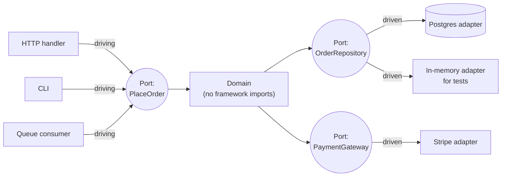

## The situation

Your domain logic imports the ORM, the HTTP framework, the payment provider's
SDK, and a logger. You want to test the pricing rules and you cannot do it
without Docker, a migration, and forty seconds of startup.

That is the problem hexagonal architecture solves. Not "clean code", not
layers, not the diagram with the rings. Testability and replaceability of the
things at the edges.

## The style, minus the decoration

The domain sits in the middle and depends on nothing. It defines **ports** —
interfaces expressed in its own vocabulary. **Adapters** on the outside
implement or invoke them.

Two kinds of port, and conflating them is the most common source of confusion:

- **Driving (primary)** — the outside world calls in. Your use cases. There are
  usually few of them and they are named after business operations.
- **Driven (secondary)** — the domain calls out. Storage, payments, mail,
  clock, random. The interface belongs to the *domain*, expressed in domain
  language: `OrderRepository.findUnpaid()`, not `SqlClient.query()`.

**The rule is the dependency direction.** Arrows point inward, always,
enforced by a build rule or an import linter rather than by good intentions.
Onion, Clean, Hexagonal — the arguments between them are about how many rings
to draw. The rule is the same and the rule is the whole benefit.

## The test for whether you should bother

Ports cost real money: an interface, an implementation, mapping code between
domain types and storage types, and one more hop for every reader of the code.
Before adding one, name the **second adapter**.

| Second adapter | Verdict |
|---|---|
| A test double that replaces something slow, external, or non-deterministic (DB, payment provider, clock, third-party API) | Worth it — this is the main case, and it is a real second adapter |
| A migration you are actually funded to do (Oracle → Postgres, provider swap) | Worth it |
| A second real implementation that exists today | Worth it |
| "We might swap the database someday" | Not worth it. You will not, and if you do, the ORM was never the hard part — the schema was |

The honest version of the rule: **wrap what you do not control, and what you
cannot afford to run in a unit test.** Everything else can be called directly.

That is why wrapping your own ORM in a repository is usually noise, while
wrapping a payment provider is usually essential — one of those two vendors is
going to have an outage, a price change, or a regional compliance problem.

## The failure mode

The cargo-culted version: every entity gets a `Model`, an `Entity`, a `Dto`, a
`Mapper`, a `Repository` interface with exactly one implementation, and a
`Service` that forwards a call unchanged. Five files, four of them mechanical,
zero flexibility gained — the abstraction has one implementation and always
will, so it is indirection wearing an architecture costume.

The diagnostic question in review: *if this port had two implementations
tomorrow, which two?* If nobody can answer, delete the port and call the thing
directly. You can always extract it later — that extraction is cheap and
local, which is exactly why doing it prematurely is a bad trade.

## When the default is wrong

- **CRUD with no rules.** If the use case is "validate, save, return", the
  domain in the middle is empty and you have built a hexagon around a hole.
  [Layered](../layered/) is the correct style and it is not a compromise.
- **Framework-native stacks.** Rails' Active Record and Django's ORM are
  designed around the pattern hexagonal architecture forbids. You can fight
  them; you will lose the framework's ecosystem, its generators, and half its
  documentation to win a testing argument you could have won with a seeded
  transactional test database.
- **Small team, single delivery mechanism, short horizon.** The style pays off
  over years and over multiple entry points. An internal tool with one HTTP API
  and two engineers will not live long enough to collect.

## What it costs

**A permanent indirection tax on reading.** Following one request through the
code now means jumping through an interface at every edge. IDEs make this
survivable; code review and incident debugging make it annoying. It is a real,
recurring cost paid by everyone, in exchange for a benefit collected by a few.

**Mapping code, forever.** Domain type to persistence type to wire type. It is
boring, it is where bugs hide, and generating it is usually worse than writing
it.

**Performance blind spots.** A repository interface that looks like a
collection hides whether a call is one query or N. Hexagonal designs are
disproportionately prone to N+1 problems precisely because the port made the
cost invisible — the domain thinks it is iterating a list.

**Over-abstraction is contagious.** Once ports are the house style, every new
dependency gets one, including the ones that never needed it. Budget for
periodic deletion of ports with one adapter; without it, the style ratchets
in only one direction.

## See also

- [Layered (N-Tier): The Style Nobody Chose](../layered/)
- [Coupling and Cohesion in Practice](/docs/foundations/coupling-and-cohesion/)
- [API Contracts and Versioning](/docs/system-design/api-contracts/)
- [Choosing a Datastore Without Regret](/docs/data-and-state/choosing-a-datastore/)
