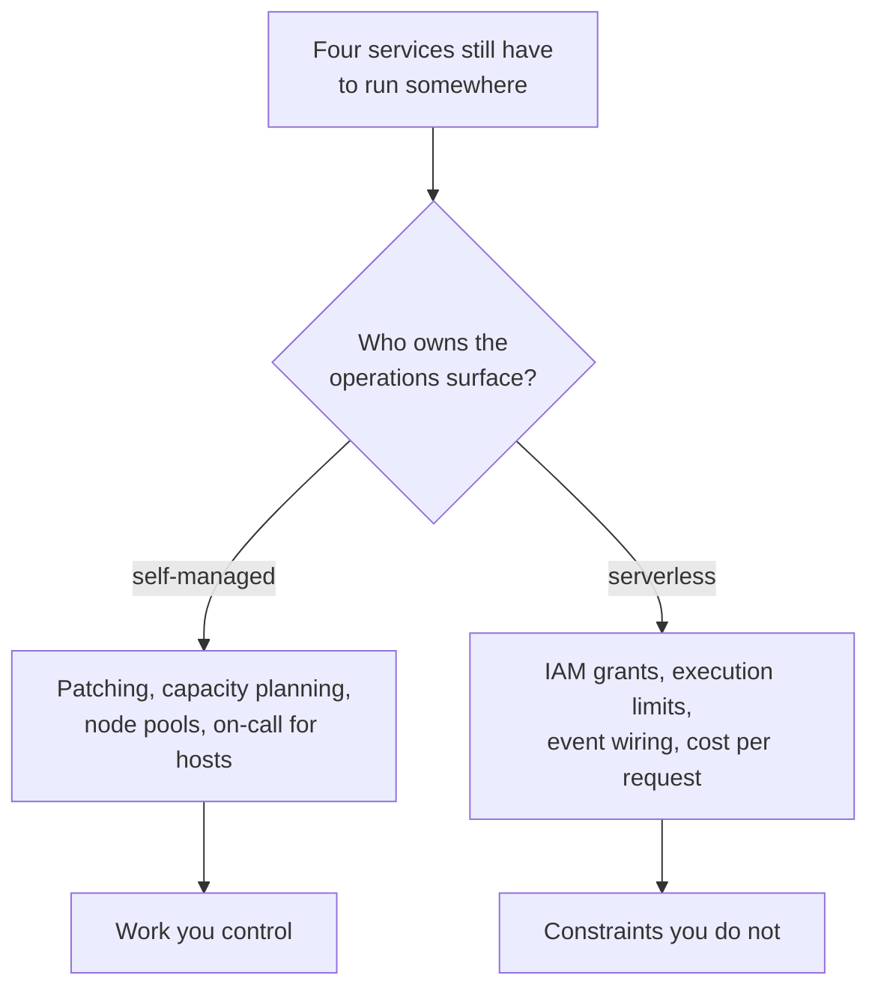
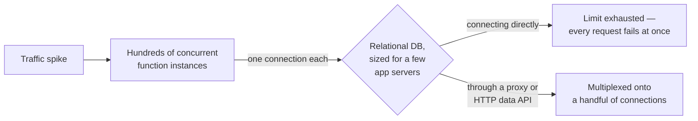

## The situation

Four services, two engineers, and no platform team. Running Kubernetes for this
is [absurd](/docs/platform/kubernetes-reality/), and yet somebody still has to
patch, scale, and wake up for whatever you do run.

The serverless style answers that by owning no long-lived compute: functions or
managed containers scaled by the provider, state in managed services, glue made
of queues and events. What you are buying is not "no operations" — it is a
*different* operations surface, one that is mostly configuration.

## What it genuinely buys

- **No patching, no capacity planning, no node pool.** The largest recurring
  ops cost for a small team simply goes away.
- **Scale to zero, and up.** Spiky and low-average workloads — internal tools,
  webhooks, batch triggers, admin backends — are dramatically cheaper, and idle
  environments cost nothing.
- **A default security posture you did not have to build.** Isolation and
  patching come from the provider. For a team with no security engineer this is
  a genuine step up.
- **Small blast radius per unit.** A failing function does not take down a host
  shared with three other things.

## What it actually costs you to learn

These are the ones that bite in month three, not month one.

**Execution limits shape the design.** Timeouts, memory ceilings, payload
sizes, and concurrency caps are architectural constraints, not configuration
details. A job that grows past the timeout does not get a bigger box — it needs
to be restructured into steps with checkpoints, or moved to a different runtime
entirely. Design for that split before you discover it at 14 minutes 55
seconds.

**Connections do not pool.** Hundreds of concurrent function instances each
opening a connection will exhaust a relational database that was sized for a
handful of application servers. The answer is a connection proxy or an
HTTP-based data API. This is the most common serverless production incident and
it appears exactly when a launch goes well.

**IAM becomes the architecture.** Every interaction is a permission grant. Done
well this is genuine least privilege — better than most VM estates ever
achieve. Done in a hurry it is a wildcard policy copied from a blog post, and
misconfiguration, not exploitation, is the dominant risk in this style. See
[Least Privilege and Auditability](/docs/security/least-privilege/).

**Local development is worse, permanently.** Emulators drift from the real
platform in exactly the behaviours you care about — IAM, event shapes,
throttling. The honest answer is per-developer cloud environments and fast
deploys, which means investing in [environment
tooling](/docs/platform/environments-and-secrets/) rather than pretending
`localhost` will do.

**You are distributed by default.** Even a small application becomes a set of
functions, queues, and event rules. You inherit async debugging, retries, and
partial failure — the microservices tax — without having chosen microservices
or gained the organisational benefit that justifies it. Tracing is not
optional here either.

**The cost curve inverts.** Per-request pricing is a bargain at low and spiky
volume and expensive at sustained high throughput. There is a crossover point
where a reserved instance is several times cheaper. Know roughly where yours
is; it is arithmetic, not ideology, and the answer changes as you grow.

## When the style is right

- Spiky, bursty, or low-average traffic. Anything triggered by events rather
  than by constant load.
- Glue: reacting to a webhook, moving a file, fanning out a notification, a
  scheduled job. This is the strongest case and it is not controversial.
- Small teams with no ops capacity, where the alternative is not a
  well-run platform but a badly-run one.
- Workloads with genuinely unpredictable scale, where over-provisioning is
  expensive and under-provisioning is an outage.

## When the default is wrong

- **Sustained high throughput.** The cost crossover, plus you are paying a
  premium for elasticity you are not using.
- **Tight, predictable latency budgets.** Cold starts have improved a great
  deal and are still real for heavier runtimes and private-network attachment.
  A p99 requirement measured in tens of milliseconds is a hard fit.
- **Long-running or stateful work.** Streaming connections, big batch jobs,
  anything holding state in memory across requests. Fighting the model here
  costs more than a container would.
- **Hard portability requirements.** Not because functions are hard to
  rewrite — they are usually small — but because the *composition* is the
  application. Your queues, event rules, IAM policies and managed datastore
  semantics are the design, and none of that ports.

## What it costs

**Lock-in is at the seams, not the code.** Rewriting the handlers is a week.
Replacing the identity model, the event bus semantics, and the datastore's
consistency guarantees is a rewrite. Judge lock-in by how much of your design
lives in provider configuration, not by how many lines are provider-specific.

**Observability is the provider's, and it is vendor-shaped.** You get a lot for
free and you get it in their vocabulary. Exporting to your own stack is
possible and is another integration to own.

**Cost becomes a per-request property of your code.** A retry loop or an
accidental fan-out is now a bill rather than a CPU graph. Budget alerts are not
finance hygiene here, they are an outage-prevention control.

**The limits are someone else's roadmap.** Quotas, regional availability, and
deprecations move on the provider's schedule. This is the real trade of the
style: you exchanged work you controlled for constraints you do not.

## See also

- [Kubernetes: What You Sign Up For](/docs/platform/kubernetes-reality/)
- [Multi-Tenancy and Cost Boundaries](/docs/platform/tenancy-and-cost/)
- [Least Privilege and Auditability](/docs/security/least-privilege/)
- [Observability: What to Actually Wire](/docs/reliability/observability/)
