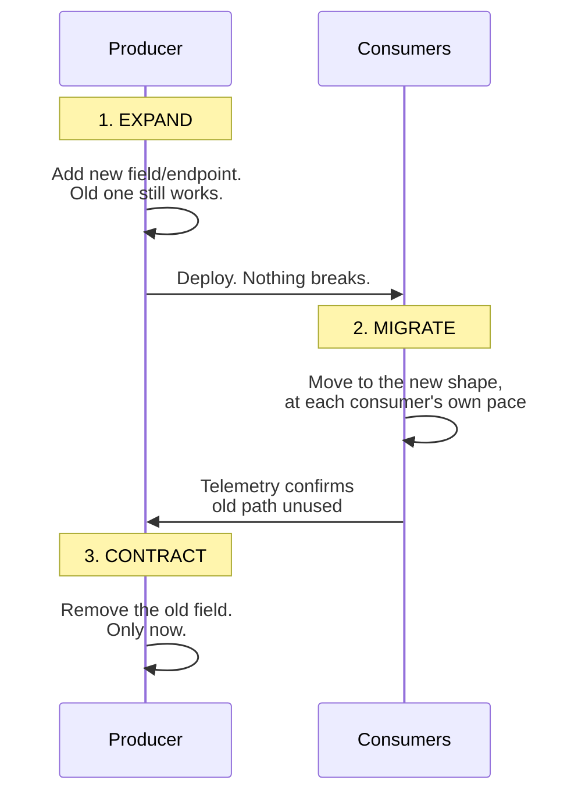

## The situation

You own an API. Someone consumes it. You need to change it. The question is not
"how do I version this" — it is "how do I change this without a synchronised
deploy," and versioning is only one of the answers.

## The default

**Expand, migrate, contract.** Never change a contract in place.

The third step is the one teams skip, which is why every mature codebase has
deprecated fields from 2019 still in the response. Skipping it is survivable;
skipping steps 1 and 2 is not.

Concretely, the rules that make expand/contract work:

- **Additive changes only** in a version: new optional fields, new endpoints,
  new enum values *if consumers were told to tolerate unknown values*.
- **Never repurpose a field.** Changing the meaning of `status` while keeping
  the name is semantic coupling and it corrupts data silently.
- **Never tighten validation** without a deprecation window. Loosening is safe;
  tightening breaks working callers.
- **Never change a default.** A consumer relying on the old default has no
  signal that anything changed.

## Versioning, when you need it

You need an explicit version only for changes that cannot be made additively.
When you do:

| Approach | Good for | Cost |
|---|---|---|
| URL path (`/v2/orders`) | Public APIs, clear cache keys, easy routing | Duplicated routes; version sprawl is visible and shaming, which is a feature |
| Header (`Accept: …v=2`) | Internal APIs, fine-grained | Invisible in logs and browsers; harder to debug |
| Field-level (`schemaVersion` in body) | Events and messages | Every consumer branches; ages badly |
| No version, additive forever | Internal APIs with few consumers you can see | Requires discipline; works better than it sounds |

For internal APIs with a handful of known consumers, the last row is often
correct. Versioning is coordination machinery, and machinery you do not need is
just cost.

## Consumer-driven contract tests

The mechanism that makes "additive only" enforceable rather than aspirational:
each consumer publishes the subset of the contract it actually depends on, and
the producer's CI fails if a change would break any of them.

This is worth the setup cost the moment you have more than two consumers you
cannot see in one repository. Below that, a shared schema file and code review
does the same job for a fraction of the effort.

## When the default is wrong

Public APIs with paying customers cannot contract on your schedule. There, the
deprecation window is a business commitment measured in quarters or years, and
sometimes the right answer is that v1 lives forever. Price that in when you
design v1 — the first public version is one of the most irreversible decisions
you will make.

## What it costs

Expand/contract means the codebase carries both shapes during the migration,
sometimes for a long time. That is real complexity: two code paths, two sets of
tests, and a cleanup ticket that competes with feature work forever.

Mitigate by making the contract step *scheduled*, not aspirational — a
calendared removal date recorded when the expansion lands, and telemetry on the
old path so you know when it is safe.

## See also

- [Service Boundaries](../service-boundaries/)
- [Schema Migrations Without Downtime](/docs/data-and-state/zero-downtime-migrations/)
