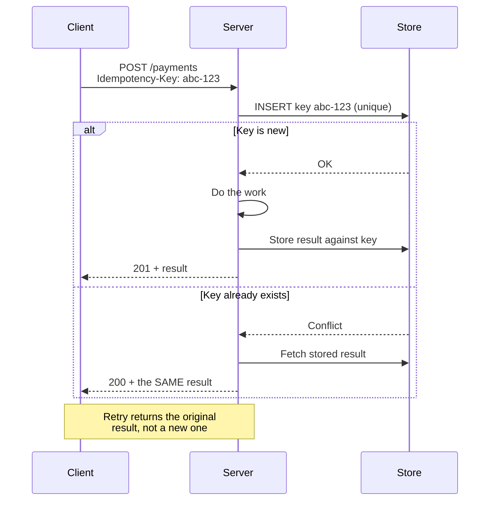

## The situation

A request times out. The client does not know whether the work happened. It
retries. Now you may have two orders, two charges, or two emails — and the
client still does not know.

This is not an edge case. In any distributed system, "I did not get a response"
is indistinguishable from "it did not happen," and that ambiguity is permanent.
The only question is whether you designed for it.

## The default

Every state-changing operation that can be retried needs an **idempotency
key**: a client-generated identifier that lets the server recognise a repeat.

The critical detail: a duplicate must return **the original result**, not an
error and not a fresh execution. A client that gets a 409 on retry has learned
nothing and will still not know what happened.

Practical rules:

- The key comes from the **client**, generated before the first attempt, and
  stays constant across retries.
- Store the key with the result, in the same transaction as the work. A
  separate "seen keys" table updated afterwards has a window where a crash
  loses the record.
- Give keys a TTL long enough to outlive any plausible retry (24 hours is a
  common choice) and expire them, or the table grows forever.
- Scope keys per caller so one tenant cannot collide with another.

## Making retries safe on the client side

| Rule | Why |
|---|---|
| Exponential backoff with **jitter** | Without jitter, all clients retry simultaneously and you get a thundering herd that keeps the service down |
| A retry budget, not just a count | "3 retries" per request still means 3x load during an outage; a budget caps total retry traffic as a fraction |
| Only retry on retryable errors | Retrying a 400 is pure waste; retrying a 500 or a timeout is correct |
| Deadline propagation | Pass the remaining time budget downstream so B does not spend 30s on a request A abandoned after 5s |
| Never retry inside a retry loop | Nested retries multiply: 3 layers × 3 attempts = 27 requests from one click |

Nested retries are the mechanism behind a surprising number of self-inflicted
outages. A service that is slightly slow gets hit with an order of magnitude
more traffic precisely when it can least handle it, which is the shape of a
metastable failure — the system stays down after the original trigger is gone.

## Natural idempotency

Some operations are idempotent without any machinery, and preferring them is
free architecture:

- `PUT` with a full resource state, rather than `POST` with a delta.
- "Set balance to X" rather than "add X to balance" — though this trades away
  concurrent-update safety, so it is not universally better.
- Upserts keyed on a business identifier.
- Consumers that check "have I already processed offset N" before acting.

Where you can express the operation as *declaring a desired state* rather than
*applying a change*, do. Kubernetes' whole control model rests on this.

## When the default is wrong

Read-only endpoints need none of this. Neither do operations whose duplication
is genuinely harmless — appending to an idempotent log, or a cache warm.

Do not add idempotency keys to everything reflexively; the storage and the code
path are not free. Add them where duplication has a cost a user would notice.

## What it costs

An extra write on the hot path, a table to maintain, and a subtle correctness
requirement (key and work must commit atomically) that is easy to get wrong in
a way tests do not catch.

The alternative cost is charging a customer twice, which is not a bug you get to
fix quietly.

## See also

- [Synchronous vs Asynchronous](../sync-vs-async/)
- [Failure Modes](/docs/reliability/failure-modes/)
