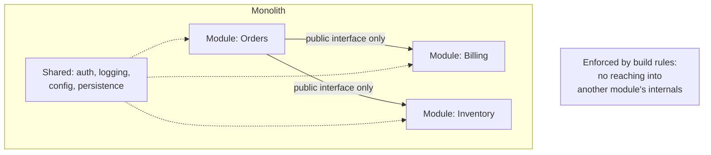

## The situation

A new system, a small team, and a strong instinct that "we should build it as
microservices so it scales." The instinct conflates two different kinds of
scale: **load scale** and **organisational scale**. Microservices help with the
second. They rarely help with the first, and they actively hurt it at small
sizes by adding network hops to what used to be function calls.

## The default

Start with a modular monolith. One deployable, one datastore, clear internal
module boundaries enforced by package structure, build rules, or a linter.

Split a module out when you can point at a specific, present-tense problem:

| Real reason to split | Not a reason to split |
|---|---|
| Two teams are blocking each other on deploys | "It feels cleaner" |
| One component needs radically different scaling (10x traffic, GPU, huge memory) | "Everyone does microservices" |
| A compliance boundary requires isolation | "It will scale better someday" |
| One part needs a different runtime or language for a real reason | The domain diagram has a box around it |
| Failure in one part must not touch another, and you have proven the monolith cannot isolate it | A consultant recommended it |

The first row is the dominant real cause. Services are an answer to *human*
coordination cost.

## What a modular monolith needs to work

Without these it is a big ball of mud, and the "we should have used services"
conclusion becomes self-fulfilling.

- **Enforced boundaries.** Not conventions — actual build failures. Java module
  system, .NET internal visibility, Go internal packages, an import linter in
  Python, ESLint rules in TypeScript. Whatever your language offers.
- **One owner per module**, named.
- **No cross-module database joins.** This is the one that people skip, and it
  is the one that makes a future split possible or impossible. Modules talk
  through interfaces, not through each other's tables.
- **Module-level tests** that run without booting the whole app.

If you do these, extracting a service later is a week of work. If you skip
them, it is a quarter, and you will conclude that "splitting is hard" when what
was actually hard was the mess.

## When the default is wrong

- **You already have organisational scale.** Forty engineers on one deployable
  is a coordination disaster. Start with services split by team.
- **Genuinely heterogeneous workloads.** A batch ML training job and a
  request-response API do not belong in the same deployable, and no amount of
  modularity will make them.
- **Hard isolation requirements.** Payment card data, protected health
  information, or a workload that must run in a customer's own environment.
- **You are extending an existing service landscape.** Adding a modular
  monolith into an organisation that already runs fifty services is
  swimming upstream against every tool they have.

## What it costs

Being the team with a monolith in a microservices-fashion industry means
defending the choice repeatedly to new joiners, in hiring conversations, and
sometimes to leadership. Budget for that. A short written rationale — see
[ADRs](/docs/knowledge/adr/) — costs less than having the argument monthly.

The genuine technical cost: a monolith couples your deploy cadence and your
failure domain. One bad change can take everything down, and one slow test
suite slows everyone. Both are manageable with feature flags, good tests, and
[progressive delivery](/docs/delivery/progressive-delivery/) — but they are
real, and they get worse with headcount.

## See also

- [Service Boundaries](../service-boundaries/)
- [The Boring Baseline](/docs/foundations/boring-baseline/)
