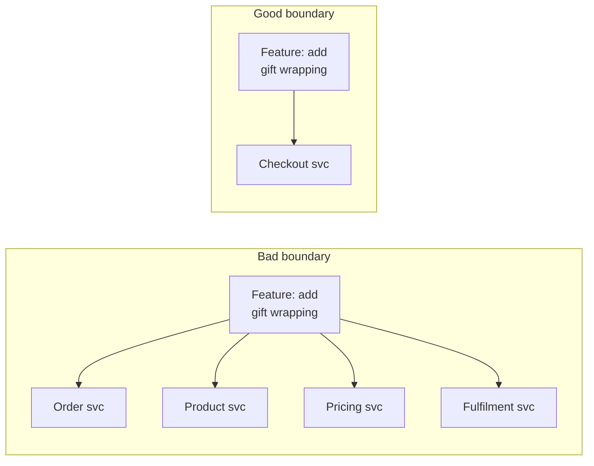

## The situation

You have decided to split. Now the question is *where*, and most teams answer
it by looking at the domain model and putting a service around each noun. User
service, Order service, Product service, Notification service.

This produces boundaries that look tidy on a diagram and generate constant
cross-service chatter in production, because business operations do not respect
noun boundaries.

## The default

Draw the boundary where three things line up:

1. **A team owns it end to end.** One team, one service, no shared ownership.
   Two teams owning one service is worse than one team owning two.
2. **It changes for one reason.** If a feature request routinely touches three
   services, the boundary is in the wrong place.
3. **It owns its data.** Nobody else writes its tables. If two services must
   write the same rows, they are one service wearing a costume.

When these three conflict, ownership wins. A slightly awkward technical
boundary with clear ownership outperforms a beautiful technical boundary that
two teams share.

## The test that actually works

Take your last ten feature requests. For each, list the services that would
change.

If most features touch one service, the boundaries are good. If most features
touch three or more, you have distributed a monolith and inherited every cost
of distribution with none of the independence.

Run this test *before* splitting, using the modules you intend to extract. It
is nearly free and it is the single most predictive exercise available.

## Surviving a reorg

Teams get reorganised roughly annually. Services do not move as easily as
people do, so the ownership alignment you carefully built decays.

Practical mitigations:

- **Name services after capabilities, not teams.** `checkout` survives; the
  `growth-platform-service` does not, and renaming is a migration.
- **Keep the number of services below the number of teams.** More services than
  teams guarantees orphans, and orphaned services are where security patches go
  to die.
- **Maintain an ownership registry** that is checked in CI. A service with no
  owner should fail a build somewhere, not be discovered during an incident.
- **Prefer coarse services.** Merging two services later is much easier than
  splitting one, and coarse services absorb reorgs better.

That last point is underrated. The reversibility asymmetry — merge is easy,
split is hard — argues for erring on the side of fewer, larger services at
every decision point.

## When the default is wrong

Sometimes the technical constraint genuinely dominates ownership. A service
that must run on specialised hardware, in a specific region, or under a
different compliance regime has its boundary determined externally. Accept it
and invest in the contract instead.

Also: very small organisations should ignore the ownership rule, because there
is only one team. Split on technical need only, and split rarely.

## What it costs

Ownership-aligned boundaries mean your architecture diagram mirrors your org
chart, which is Conway's Law working *for* you rather than against you. The
cost is that architectural change now requires organisational change, and org
change is slow and political.

You are choosing to make architecture a leadership concern rather than a purely
technical one. That is usually correct — but it does mean that fixing a bad
boundary requires more than a refactor.

## See also

- [Coupling and Cohesion](/docs/foundations/coupling-and-cohesion/)
- [API Contracts and Versioning](../api-contracts/)
