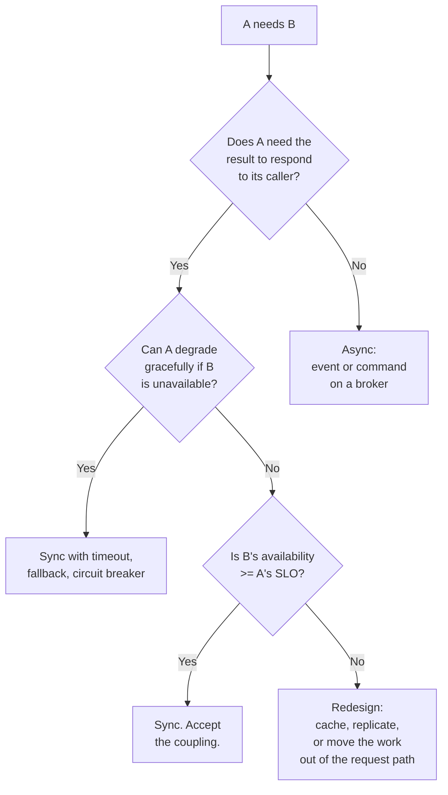

## The situation

Service A needs something from service B. HTTP call, or a message on a broker?
This gets argued as a philosophy question ("event-driven architecture") when it
is actually a question with a mechanical answer.

## The default

**Ask what the caller does while waiting.**

- If the caller cannot proceed without the answer and a human is waiting →
  **synchronous**. A user staring at a spinner needs a response, and hiding a
  request-response interaction behind a queue just means you rebuilt
  request-response badly, with correlation IDs and a timeout you forgot.
- If the caller can proceed and the work merely needs to *eventually* happen →
  **asynchronous**. Sending an email, updating a search index, recalculating a
  recommendation, emitting an audit record.

That single question resolves the large majority of cases correctly.

## The decision in full

The bottom-right branch is where most real problems live. If A promises 99.9%
availability and synchronously depends on B, C, and D, each at 99.9%, A's
ceiling is about 99.7% before A's own bugs are counted. Availability multiplies
down a synchronous chain.

## Events versus commands

If you go async, distinguish two things that look identical on the wire:

| | Event | Command |
|---|---|---|
| Says | "This happened" | "Do this" |
| Names | Past tense: `OrderPlaced` | Imperative: `SendInvoice` |
| Consumers | Zero to many, publisher does not care | Exactly one, intended |
| Coupling | Publisher knows nothing about consumers | Sender knows the receiver |
| Adding a consumer | No change to publisher | N/A |
| Failure handling | Consumer's problem | Sender may care |

Mixing them is the most common event-driven mistake. A topic named
`order-events` that actually carries "please charge this card" is a command
queue with confusing branding, and the first time two consumers subscribe you
double-charge someone.

## When the default is wrong

- **Async for load levelling even though the caller waits.** A spiky workload
  where the caller can poll or receive a callback: accept the complexity, queue
  the work, return a job ID. This is genuinely correct for uploads, report
  generation, and anything with unpredictable duration.
- **Sync even though the caller does not need the answer**, because the async
  infrastructure does not exist yet and adding a broker is a bigger commitment
  than the feature warrants. Legitimate. Write it down as debt and mean it.

## What it costs

Async buys decoupling and pays in observability and reasoning. You lose the
stack trace. "Where did this message go" becomes a real investigation. You now
need: idempotent consumers, a dead-letter queue with someone watching it,
ordering guarantees you understand, replay tooling, and schema evolution on the
message format.

None of that is optional, and teams routinely adopt a broker having budgeted
for none of it. The broker is the cheap part.

## See also

- [Idempotency and Retries](../idempotency-and-retries/)
- [Failure Modes](/docs/reliability/failure-modes/)
